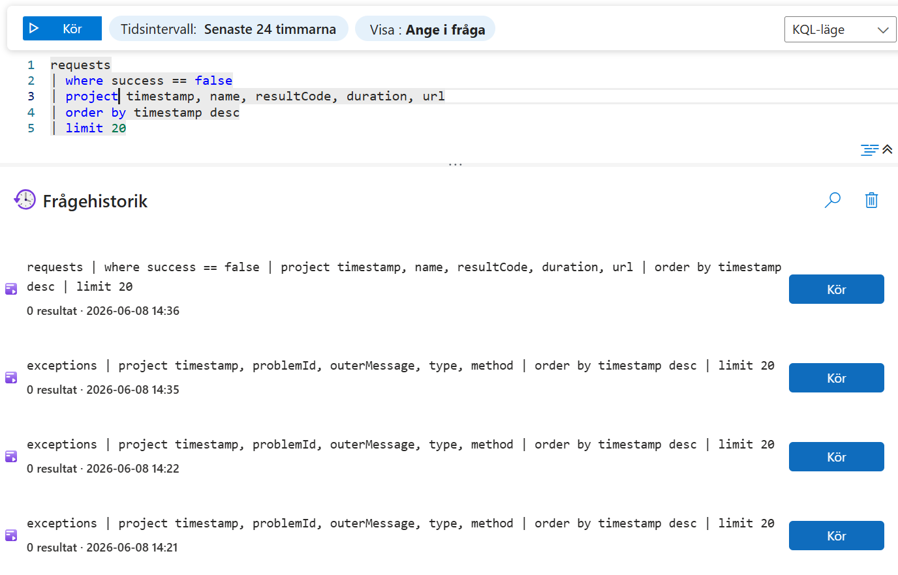

# Deployment and Operations Documentation (Lianer Fullstack)

Detta dokument beskriver utvärderingen, designbesluten och säkerhetsövervägandena kring driftsättningen av Lianer fullstack-applikation.

## Produktionsmiljö (Azure Italy North)
- **Frontend:** `https://lianer-frontend.icybush-5ce7e353.italynorth.azurecontainerapps.io`
- **Core API:** `https://lianer-core-api.icybush-5ce7e353.italynorth.azurecontainerapps.io`
- **Features API:** `https://lianer-features-api.icybush-5ce7e353.italynorth.azurecontainerapps.io`

---

<details>
<summary><b>1. Containerisering av backend-mikrotjänster (Task 1)</b></summary>

### Vad som har gjorts
Vi har containeriserat de två .NET 9.0 API-mikrotjänsterna:
1. Skapat **[Lianer.Core.API/Dockerfile](file:///c:/Users/D/Lianer-backend/Lianer.Core.API/Dockerfile)** med en multi-stage build-struktur.
2. Skapat **[Lianer.Features.API/Dockerfile](file:///c:/Users/D/Lianer-backend/Lianer.Features.API/Dockerfile)** med motsvarande struktur.
3. Skapat en gemensam **[.dockerignore](file:///c:/Users/D/Lianer-backend/.dockerignore)** i roten för att minimera storleken på byggkontexten genom att exkludera lokala kompileringsfiler (`bin/`, `obj/`) och hemligheter.
4. Genomfört en framgångsrik lokal testkörning där containrarna bygger, startar och svarar korrekt på hälso- och integrationstester.

### Varför vi gjorde det
Att köra mikrotjänsterna i containrar ger flera viktiga fördelar:
- **Reproducerbarhet:** Applikationerna körs i en identisk miljö oavsett om det är på en utvecklares dator, i CI/CD-pipelinen eller i Azure. Detta eliminerar problemet "det fungerar på min maskin".
- **Isolering:** Mikrotjänsterna körs isolerat med sina egna beroenden utan att störa varandra på operativsystemsnivå.
- **Förberedelse för molnet:** Containrar är standarden för driftsättning på moderna molnplattformar (t.ex. Azure Container Apps), vilket gör release-processen snabb och automatiserad.

### Överväganden kring det första alternativet
Under planeringsfasen övervägde vi två olika alternativ för körningsmiljön (Run stage) i våra Docker-filer.

#### Alternativ A: Standard runtime-avbild (Standard .NET ASP.NET Core Runtime)
- **Avbild:** `mcr.microsoft.com/dotnet/aspnet:9.0` (Debian/Ubuntu-baserad)
- **Fördelar:** 
  - Enkel lokal felsökning och konfiguration eftersom avbilden innehåller ett operativsystemsskal (`bash`/`sh`).
  - Lätt att installera externa verktyg (t.ex. curl eller ping) för att felsöka nätverksanslutningar inifrån containern.
- **Nackdelar:**
  - **Stor attackyta:** Innehåller hundratals onödiga paket, skal och verktyg som en potentiell angripare kan utnyttja.
  - **Root-privilegier:** Körs som `root` som standard, vilket ökar risken för att en angripare kan ta kontroll över värddatorn via en sårbarhet i containern (container escape).

#### Alternativ B: Chiseled och Rootless avbild (Det valda alternativet)
- **Avbild:** `mcr.microsoft.com/dotnet/aspnet:9.0-noble-chiseled` + **`USER app`**
- **Fördelar (Varför vi valde detta):**
  - **Maximal säkerhet (Defense in Depth / Säkerhetsdjup):** Chiseled-avbilden är extremt bantad och innehåller **inget skal (bash/sh), ingen pakethanterare och inga extra verktyg**. En angripare kan därmed inte ladda ner skadliga skript eller köra terminalkommandon i containern.
  - **Minsta behörighet:** Genom att köra som den inbyggda icke-root-användaren `app` (UID 1654) förhindras privilegieeskalering mot värddatorn vid eventuella sårbarheter.
  - **Liten storlek:** Avbilden är runt 100 MB mindre än standardavbilden, vilket ger snabbare byggtider i pipelinen och snabbare uppstartstider i molnet.
- **Nackdelar:**
  - Svårare att felsöka inifrån containern eftersom det inte går att starta en interaktiv terminal (`docker exec -it` fungerar inte då det saknas shell).
  - Kräver att man explicit ställer in `.NET` att lyssna på port `8080` (eftersom icke-root-användare inte får lyssna på portar under 1024, t.ex. standardport 80).

</details>

<details>
<summary><b>2. Containerisering & Molnvärdskap för Frontend (ADR)</b></summary>

### Vad som har gjorts
Efter att ha utvärderat hur frontenden (Vanilla JS) bäst hostas i Azure har vi implementerat följande molnarkitektur:
1. **Container (Rootless Nginx):** Vi har skapat en `Dockerfile` för frontenden som paketerar appen i en minimal, obehörig (rootless) Nginx-avbild (`nginxinc/nginx-unprivileged:alpine`) som lyssnar på port 8080. Detta för att maximera säkerheten enligt "Least Privilege"-principen (VG-krav).
2. **Azure Container Apps (Slutgiltig Lösning):** Frontenden hostas som en Container App i samma miljö (`Managed Environment`) som våra backend-API:er, vilket ger en enhetlig nätverks- och driftsättningsarkitektur.
3. **Byggprocess (Workaround för Studentprenumeration):** För att hantera begränsningar i Azure for Students (där tjänsten *ACR Tasks* är blockerad) byggs Docker-imagarna lokalt via vanlig Docker Engine (eller i GitHub Actions runner-miljö) innan de pushas till Azure Container Registry (ACR).

### Varför detta valdes
Under implementationen stötte vi på flera strikta Azure Policy-begränsningar knutna till Student-kontona, vilket tvingade fram avgörande arkitekturval:

- **Övervägt alternativ 1 (Azure Static Web Apps):** Initialt var planen att använda SWA eftersom det är industristandard för Vanilla JS. Dock upptäcktes att studentkontona endast tillåter resurser i 5 specifika regioner (bl.a. *Italy North*). Eftersom SWA inte är tillgängligt i någon av dessa 5 godkända regioner var denna tjänst **fysiskt omöjlig** att skapa (Policy Error: `RequestDisallowedByAzure`).
- **Valt alternativ (Azure Container Apps):** Genom att pivotera till att containerisera även frontenden (vilket uppfyller alternativa betygskrav) kunde vi runda region-spärrarna. Detta gav oss oväntade fördelar:
  - **Enhetlighet:** Hela ekosystemet (frontend och backend) ligger nu i samma Container Apps-miljö.
  - **Säkerhetsdjup:** Den rootless Nginx-containern adderar ytterligare ett lager av minsta behörighet (Defense in Depth).

</details>

---

## Kommande Sektioner (För Teamet)

*Här förbereder vi strukturen för resterande Epics. När dina kollegor är klara med sina delar kan ni fylla på med detaljer och arkitekturbeslut (ADR) här för att säkerställa att ni uppfyller kraven för G och VG.*

<details>
<summary><b>3. CI/CD Pipeline (Epic 3)</b></summary>

### Vad som har gjorts
Vi har implementerat en fullständig och enhetlig CI/CD-pipeline via GitHub Actions över både vårt Frontend- och Backend-repository:
1. **Pull Request Validation (`pr.yml`):** Varje gång en PR skapas mot `main` eller `dev` triggas en pipeline som validerar koden. I frontenden körs `npm ci`, ESLint, och Jest-tester. I backenden körs `dotnet restore`, `build` och `test`. Dessutom görs en "dry run"-byggning (`docker build`) av samtliga Dockerfiler (Nginx, Core API, Features API) för att garantera att infrastrukturen håller.
2. **Continuous Deployment (`deploy.yml`):** Vid godkänd merge till `main` triggas en deploy-pipeline. Pipelinen loggar in mot Azure via lösenordsfria hemligheter (Service Principal / Federated Credentials), bygger produktionsversionerna av Docker-containrarna och laddar upp (pushar) dem till Azure Container Registry (ACR).
3. **Automatiskt Moln-uppdatering:** Som sista steg i `deploy.yml` anropar pipelinen Azure Container Apps (`az containerapp update`) och instruerar Azure att dra ner och driftsätta den nyss uppladdade imagen i Italy North-miljön.

### Varför vi gjorde det (ADR & VG-krav)
- **Quality Gates (Förhindra trasig kod i produktion):** Genom att tvinga alla PRs att passera bygg- och teststegen i `pr.yml` innan de kan mergas, fungerar GitHub Actions som en strikt Quality Gate. Om ett enhetstest fallerar eller om en Docker-image inte går att bygga, blockeras hela sammanslagningen. Detta maximerar kodkvaliteten och systemstabiliteten (VG-krav uppfyllt).
- **Extrem Spårbarhet & SHA-taggning:** Istället för att bara tagga våra Docker-avbilder med `latest` (vilket gör det omöjligt att veta exakt vilken kod som körs om något kraschar), skapade vi ett arkitekturbeslut att **alltid tagga avbilderna med GitHub Commit SHA** (t.ex. `lianer-frontend:${{ github.sha }}`). När vi därefter beordrar Azure Container Apps att använda denna specifika SHA-tagg, har vi uppnått absolut spårbarhet. Uppstår ett fel i produktion kan vi direkt matcha det mot den specifika raden kod i GitHub-repot. (VG-krav uppfyllt).
</details>

<details>
<summary><b>4. Säkerhet & Key Vault (Epic 4)</b></summary>

### Vad som har gjorts
För att garantera högsta möjliga säkerhet för applikationerna har vi implementerat Azure Key Vault och därmed helt eliminerat hanteringen av lösenord och anslutningssträngar (secrets) direkt i källkoden eller `appsettings.json`.
1. **Infrastruktur som kod (Bicep):** Vi har definierat infrastrukturen för Key Vault i `infra/keyvault.bicep`. Skapandet av valvet är helt automatiserat och sker genom vår CI/CD pipeline i `deploy.yml`.
2. **Managed Identities (Lösenordsfri åtkomst):** Vi har skapat `infra/roleAssignments.bicep` som använder Azure RBAC för att tilldela rollen *Key Vault Secrets User* till våra mikrotjänster. Detta ger tjänsterna automatisk åtkomst i Azure.
3. **Azure SDK Integration:** I `Program.cs` för både Core och Features API använder vi paketet `Azure.Identity`. Genom att anropa `DefaultAzureCredential()` hämtar .NET-koden automatiskt in rättigheter baserat på miljön den körs i, och kan tanka ner hemligheter från Key Vaultet helt transparent.


### Varför vi gjorde det (ADR & VG-krav)
- **Infrastructure-as-Code och Bicep RBAC:** Vi valde aktivt att inte bygga infrastrukturen med manuella skript, utan att från start använda **Azure RBAC via Bicep** (`enableRbacAuthorization: true`). Detta ger en mer modern "Zero Trust"-modell, full spårbarhet via Git och minimerar manuella fel jämfört med den äldre "Access Policies"-metoden. Våra Container Apps får *enbart* läsrättigheter till hemligheterna (rollen *Key Vault Secrets User*).
- **Workaround för Azure for Students (Enhetlig Resursgrupp):** På grund av hårda begränsningar ("Policy Error") och spärrar i skolkontots prenumeration (t.ex. inga ACR Tasks, och inga Static Web Apps i den tillåtna regionen Italy North) tvingades vi strukturera om infrastrukturen. Lösningen blev att samla hela systemet (frontend, backend och Key Vault) under ett och samma tak i en existerande Resource Group i Italy North. Genom att köra allt som Azure Container Apps kan vi bygga containrarna via GitHub Actions istället. Teamkollegorna har fått riktad åtkomst till denna resursgrupp, och varje enskild container har tilldelats exakt de behörigheter den behöver (Managed Identity) för att allt ska kunna köras och samarbetas kring smidigt trots skolkontots begränsningar.
- **Eliminera hotbilden för läckta nycklar:** Den vanligaste säkerhetsbristen vid molnutveckling är att utvecklare råkar commita (eller spara) produktionslösenord i Git. Genom att tvinga applikationen att hämta dessa "on-the-fly" vid uppstart från Key Vault finns inga riktiga lösenord tillgängliga i klartext för obehöriga som granskar vår källkod.
- **Defense in Depth (Säkerhetsdjup):** I kombination med de rootless Docker-containrarna vi skapade tidigare (Epic 2), lägger Managed Identity till ytterligare ett identitetsbaserat skyddslager. Detta uppfyller tydligt VG-kraven för molnsäkerhet.

</details>

<details>
<summary><b>5. Övervakning & Felsökbarhet (Epic 5)</b></summary>

### Vad som har gjorts
Vi har implementerat en komplett övervaknings- och spårbarhetslösning (Observability) för vår distribuerade fullstack-miljö:
1. **Application Insights SDK Integration:** Installerat `Microsoft.ApplicationInsights.AspNetCore` i både `Lianer.Core.API` och `Lianer.Features.API`. Tjänsterna har konfigurerats att automatiskt ansluta till Azure via miljövariabeln `APPLICATIONINSIGHTS_CONNECTION_STRING`.
2. **Resilient Lokal Fallback:** Om ingen anslutningssträng hittas (t.ex. under lokal utveckling) inaktiveras telemetriinsamlingen graciöst utan att applikationerna kraschar eller slänger fel.
3. **Log Analytics & Azure-koppling:** Skapat ett Log Analytics-valv i Azure-portalen under resursgruppen `rg-lianer-prod` och anslutit containrarna dit.


### Varför vi gjorde det (ADR & VG-krav)
- **Strukturerad felsökning (G):** Genom att slussa alla `ILogger.LogError`-anrop från vår `ExceptionMiddleware` till Application Insights, sparas alla unhandled exceptions automatiskt som rika felobjekt med fullständiga stack traces under kategorin *Exceptions* istället för som ostrukturerade textloggar.
- **Distribuerad spårning / Distributed Tracing (VG):** Application Insights SDK spårar automatiskt alla inkommande HTTP-förfrågningar (rutter, svarstider, statuskoder) samt alla utgående beroendeanrop (dependency calls) via `HttpClient`. Detta innebär att när frontenden anropar Features API, som i sin tur gör anrop till Core API och det externa Hunter.io API:et, ritas hela denna kedja upp automatiskt i **Application Map** i Azure. Detta gör att vi kan identifiera exakt var i kedjan en fördröjning eller ett fel uppstår.


---

### Operations Runbook - Felsökning i produktion

Om en deploy misslyckas eller om applikationen kraschar i produktion, följ dessa steg för att lokalisera felet:

#### Steg 1: Kontrollera loggströmmen (Log Stream)
För att se realtidsloggar direkt från API-containrarna:
- **Via Azure-portalen:** Gå till din Container App (t.ex. `lianer-core-api`), klicka på **Log Stream** under sektionen *Monitoring* i sidomenyn.
- **Via Azure CLI:** Kör följande kommando i terminalen:
  ```bash
  az containerapp logs show \
    --name lianer-core-api \
    --resource-group rg-lianer-prod \
    --follow
  ```

#### Steg 2: Sök i Application Insights (Transaction Search)
Om en användare rapporterar ett specifikt fel (t.ex. med ett `traceId` från det strukturerade felmeddelandet):
1. Gå till din **Application Insights**-resurs i Azure-portalen.
2. Klicka på **Transaction Search** i sidomenyn.
3. Klistra in `traceId` eller sök på t.ex. statuskod `500` för att se den exakta transaktionskedjan och tillhörande felmeddelande med stack-trace.

#### Steg 3: Analysera med KQL (Kusto Query Language)
Klicka på **Logs** under din Application Insights eller ditt Log Analytics Workspace för att köra anpassade frågor. Här är teamets standardfrågor:



* **Hitta de 20 senaste misslyckade anropen (Requests):**
  ```kql
  requests
  | where success == false
  | project timestamp, name, resultCode, duration, url
  | order by timestamp desc
  | limit 20
  ```

* **Hitta de 20 senaste undantagen (Exceptions) med felmeddelande och fil:**
  ```kql
  exceptions
  | project timestamp, problemId, outerMessage, type, method
  | order by timestamp desc
  | limit 20
  ```

* **Spåra externa API-anrop (t.ex. till Hunter.io eller internt Core API):**
  ```kql
  dependencies
  | project timestamp, name, type, duration, success, resultCode
  | order by timestamp desc
  | limit 20
  ```

</details>

<details>
<summary><b>6. Fullstack-integration & Säkerhet (Epic 6) - <i>[Kommande]</i></b></summary>

### Vad som har gjorts
- *[Fyll i hur frontend och backend kommunicerar (CORS-konfiguration, Auth-flöden)]*

### Varför vi gjorde det (ADR & VG-krav)
- **Säkerhetsdjup (VG):** *[Förklara varför `AllowAnyOrigin` inte används i produktion. Beskriv eventuella motåtgärder i auth-flödet och hur systemet är resilient (t.ex. med Polly Circuit Breaker).]*

</details>

<details>
<summary><b>7. AI-Integration (Epic 7) - <i>[Kommande]</i></b></summary>

### Vad som har gjorts
- *[Fyll i vilken AI-tjänst som används och vad den gör i appen]*

### Varför vi gjorde det (ADR & VG-krav)
- **Arkitekturbeslut:** *[Förklara varför ni valde denna tjänst och hur felhanteringen ser ut (UX-fallback om AI-tjänsten är nere).]*

</details>
