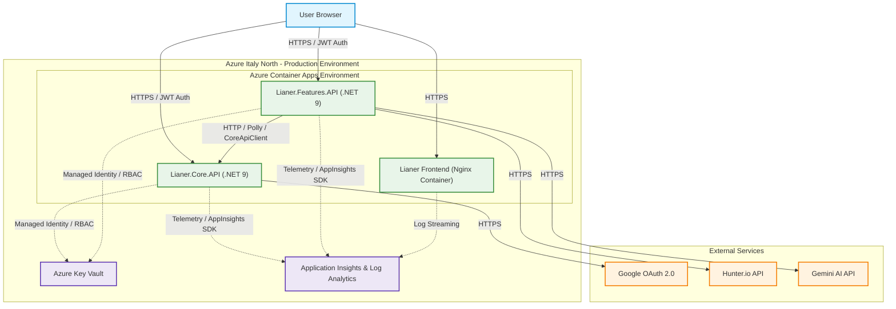
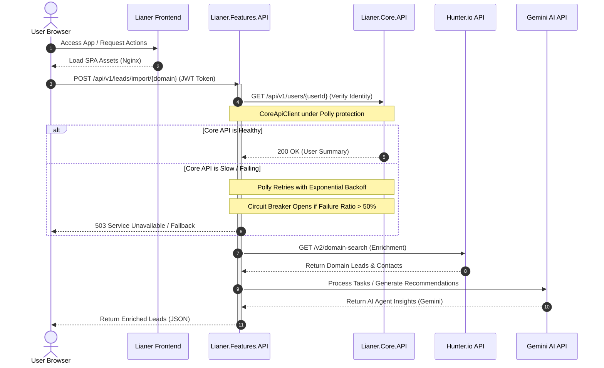

# Lianer Backend 2.0

<p align="left">
  <a href="README.en.md" title="English"></a>
  &nbsp;
  <a href="README.es.md" title="Español"></a>
  &nbsp;
  <a href="README.sv.md" title="Svenska"></a>
  &nbsp;
  <a href="README.de.md" title="Deutsch"></a>
  &nbsp;
  <a href="README.ko.md" title="한국어"></a>
  &nbsp;
  <a href="README.ja.md" title="日本語"></a>
  &nbsp;
  <a href="README.zh.md" title="中文"></a>
</p>

[Englisch](README.en.md) | [Deutsch](README.de.md) | [Dokumentation](deployment.md) | [ADR](docs/adr/0001-choosing-azure-hosting.md) | [KI](README.de.md#ki-gestützte-funktion-gemini-ai-integration) | [Frontend-Live-Demo](https://lianer-frontend.icybush-5ce7e353.italynorth.azurecontainerapps.io)

Eine sichere und verteilte ASP.NET Core 9 Microservices-Architektur für Cloud-Deployments. Das System enthält JWT-Authentifizierung, Google-OAuth2-Integration, externe API-Kommunikation mit Hunter.io und Gemini AI, passwortlose Azure-Key-Vault-Integration, CI/CD, Monitoring und ein containerisiertes Fullstack-Deployment.

**Live-Anwendung:** [Lianer Frontend App](https://lianer-frontend.icybush-5ce7e353.italynorth.azurecontainerapps.io)


---

## Inhaltsverzeichnis

- [Deployment und Systemstatus](#deployment-und-systemstatus)
- [Architektur](#architektur)
- [Funktionen](#funktionen)
- [Erste Schritte](#erste-schritte)
- [API-Dokumentation](#api-dokumentation)
- [Sicherheit](#sicherheit)
- [Tests](#tests)
- [CI/CD-Pipeline](#cicd-pipeline)
- [Erweiterte Design- und Resilienz-Muster](#erweiterte-design--und-resilienz-muster)
- [Team](#team)

---

## Deployment und Systemstatus

Das System ist vollständig containerisiert und in einer gemeinsamen Azure-Cloud-Umgebung bereitgestellt. Dieser Abschnitt fasst zusammen, wie die Anwendung gebaut, gesichert, qualitätsgesichert, überwacht und in Produktion veröffentlicht wird.

<details>
<summary><b>Containerisierung und Azure-Hosting</b></summary>

Um eine reproduzierbare Produktionsumgebung sicherzustellen, ist die gesamte Anwendung containerisiert. `Lianer.Core.API` und `Lianer.Features.API` nutzen Multi-Stage-Dockerfiles und minimale .NET-Chiseled-Runtime-Images. Die Services laufen als nicht privilegierter Benutzer `app` auf Port **8080**, wodurch die Angriffsfläche reduziert und Defense in Depth unterstützt wird. Das Frontend-SPA wird in einem unprivilegierten Nginx-Container ausgeliefert. Wegen regionaler Einschränkungen bei Azure for Students wurde Azure Container Apps statt Azure Static Web Apps gewählt.

See [deployment.md](deployment.md) and [ADR 0001: Choosing Azure Hosting](docs/adr/0001-choosing-azure-hosting.md) for full details.

<details>
<summary><b>Screenshots</b></summary>


*Azure Container Apps running status.*


*ACA environment variables configuration.*
</details>
</details>

<details>
<summary><b>Sichere Konfiguration und Key Vault</b></summary>

Produktionsgeheimnisse werden aus dem Quellcode entfernt und in Azure Key Vault gespeichert. Azure Container Apps greifen über Managed Identity und Azure RBAC mit der Rolle `Key Vault Secrets User` darauf zu. Lokale Entwicklung kann über `DefaultAzureCredential()` sicher auf User Secrets zurückfallen.

<details>
<summary><b>Screenshots</b></summary>


*Key Vault RBAC role assignments.*


*Azure Key Vault secrets list.*
</details>
</details>

<details>
<summary><b>CI/CD</b></summary>

GitHub Actions validiert jeden Pull Request und deployt automatisch nach Merges nach `main`. Die Deployment-Pipeline verwendet OIDC Federated Credentials, baut Produktionsimages, taggt sie mit dem GitHub-Commit-SHA, pusht sie nach Azure Container Registry und aktualisiert Azure Container Apps in Italy North.
</details>

<details>
<summary><b>Observability und Monitoring</b></summary>

Application Insights und Log Analytics erfassen HTTP-Requests, Antwortzeiten, Statuscodes, Exceptions, ausgehende Dependency Calls, Logs und Application-Map-Traces über die gesamte Service-Kette.

<details>
<summary><b>Screenshots</b></summary>


*Distributed tracing map in Application Insights.*


*Live telemetry stream in Application Insights.*


*Average response time per endpoint query results.*


*Traffic trend query results.*


*Failed external requests dependency query.*
</details>
</details>

---

## Architektur

### System Architecture Map

Die folgende Karte zeigt die Cloud-Infrastruktur und den Request-Flow der Lianer-Fullstack-Anwendung in Azure.



### Request and Resilience Flow

Das folgende Sequenzdiagramm zeigt, wie Requests durch das System laufen, geschützt durch Polly-Resilienzmechanismen und erweitert durch Gemini-AI-Funktionalität.



<details>
<summary><b>Service-Details und Kommunikation zwischen Services</b></summary>

Das System besteht aus einem Vanilla-JavaScript-Frontend, `Lianer.Core.API` für Benutzer, Sessions, Kontakte, Aktivitäten und Notizen sowie `Lianer.Features.API` für Leads, Importe, Task-Verarbeitung und KI-gestützte Funktionen.

### Core-API-Endpunkte

**User & Session Management**
- `POST /api/v1/users`
- `GET /api/v1/users`
- `GET /api/v1/users/{id}`
- `PUT /api/v1/users/{id}`
- `DELETE /api/v1/users/{id}`
- `POST /api/v1/sessions`
- `POST /api/v1/sessions/google`
- `GET /api/v1/sessions/google/url`

**Contacts Management**
- `GET /api/v1/contacts/{id}`
- `POST /api/v1/contacts`
- `PUT /api/v1/contacts/{id}`
- `DELETE /api/v1/contacts/{id}`

**Activities Management**
- `GET /api/v1/activities`
- `GET /api/v1/activities/{id}`
- `GET /api/v1/activities/user/{id}`
- `POST /api/v1/activities`
- `PUT /api/v1/activities`
- `DELETE /api/v1/activities/{id}`

**Activity Notes Management**
- `GET /api/v1/activities/{activityId}/notes`
- `GET /api/v1/activities/{activityId}/notes/{noteId}`
- `POST /api/v1/activities/{activityId}/notes`
- `PUT /api/v1/activities/{activityId}/notes/{noteId}`
- `DELETE /api/v1/activities/{activityId}/notes/{noteId}`

### Features-API-Endpunkte

- `GET /api/v1/leads`
- `GET /api/v1/leads/{id}/details`
- `GET /api/v1/leads/enrich/{domain}`
- `POST /api/v1/leads/import/{domain}`
- `PATCH /api/v1/leads/{leadId}/assign`
- `POST /api/v1/leads/prepare-test`

### Inter-service Communication

`Lianer.Features.API` kommuniziert über `CoreApiClient` mit `Lianer.Core.API`, geschützt durch Polly-Retry- und Circuit-Breaker-Policies.

<details>
<summary><b>Screenshot</b></summary>


*Terminal output showing successful communication between Core API and Features API.*
</details>
</details>

---

## Funktionen

<details>
<summary><b>Technical Feature List</b></summary>

### RESTful API-Design

- Plurale Ressourcen-URLs wie `/api/v1/users` und `/api/v1/leads`
- Korrekte HTTP-Methoden: GET, POST, PUT, PATCH, DELETE
- Standardisierte Statuscodes
- DTOs zur Trennung von Datenbankmodellen und API-Verträgen
- URL-Versionierung mit `Asp.Versioning.Http`

### Sicherheit

- JWT Bearer Authentication mit HMAC-SHA256
- BCrypt-Passworthashing
- Google OAuth2 SSO mit automatischer Registrierung
- Striktes CORS ohne `AllowAnyOrigin()`
- Data Annotations und zentrale Validierung
- Ownership-Prüfungen für geschützte Operationen

### Performance und Caching

- MemoryCache für teure GET-Endpunkte
- Cache-Invalidierung bei Schreiboperationen
- Exponential Backoff mit Jitter
- Fixed-Window-Rate-Limiting
- Paginierung und Filterung

### Externe Integrationen

- Hunter.io für Domain-Suche und Lead-Enrichment
- Google OAuth2 für SSO
- Google Gemini für Kategorisierung, Insights und Empfehlungen
- Azure Key Vault und User Secrets
- Polly-Resilienz-Policies

<details>
<summary><b>Screenshot</b></summary>


*Scalar API documentation for bulk lead import.*
</details>
</details>

---

## Erste Schritte

<details>
<summary><b>Setup, Installation & Running Guide</b></summary>

### Voraussetzungen

- .NET 9.0 SDK oder neuer
- Git
- Visual Studio, VS Code oder Rider
- Google-OAuth2-Zugangsdaten
- Hunter.io-API-Schlüssel

### 1. Repository klonen

```bash
git clone https://github.com/exikoz/Lianer-backend.git
cd Lianer-backend
```

### 2. User Secrets konfigurieren

**Core API:**

```bash
cd Lianer.Core.API

dotnet user-secrets set "JwtSettings:SecretKey" "MySecretKeyMustBeAtLeastThirtyTwoChars123!!"
dotnet user-secrets set "JwtSettings:Issuer" "LianerIssuer"
dotnet user-secrets set "JwtSettings:Audience" "LianerAudience"
dotnet user-secrets set "JwtSettings:ExpirationMinutes" "60"

dotnet user-secrets set "Google:Auth:ClientId" "YOUR_CLIENT_ID.apps.googleusercontent.com"
dotnet user-secrets set "Google:Auth:ClientSecret" "YOUR_CLIENT_SECRET"
dotnet user-secrets set "Google:Auth:RedirectUri" "http://localhost:3000/auth/callback"

dotnet user-secrets list
```

**Features API:**

```bash
cd ../Lianer.Features.API

dotnet user-secrets set "Hunter:ApiKey" "YOUR_HUNTER_API_KEY"

dotnet user-secrets list
```

### 3. Projekt bauen

```bash
cd ..
dotnet build
```

### 4. Services ausführen

```bash
# Terminal 1: Core API
cd Lianer.Core.API
dotnet run --launch-profile https
# Listening on: https://localhost:5297

# Terminal 2: Features API
cd Lianer.Features.API
dotnet run --launch-profile https
# Listening on: https://localhost:5298
```

### Ports

| Service | HTTP | HTTPS |
|---------|------|-------|
| Core API | 5297 | 7115 |
| Features API | 5266 | 7089 |
</details>

---

## API-Dokumentation

<details>
<summary><b>Scalar API Details & Verification</b></summary>

Beide Services stellen im Development-Modus interaktive API-Dokumentation über Scalar bereit. Core API ermöglicht Tests von Registrierung, Login, Google SSO, JWT-geschützten Endpunkten, Kontakten, Aktivitäten und Notizen. Features API ermöglicht Tests von Lead-Enrichment, Bulk-Import und angereicherten Leads mit Benutzernamen aus Core API.

### Core API

**URL:** `https://localhost:5297/scalar/v1`


*Google OAuth2 endpoint testing in Scalar.*


*Successful registration of a new user in Core API.*

### Features API

**URL:** `https://localhost:5298/scalar/v1`


*Enriched lead list with usernames from Core API.*


*Successful import and enrichment of leads from Hunter.io in Features API.*
</details>

---

## Sicherheit

<details>
<summary><b>Authentication, SSO, CORS & Key Vault</b></summary>

### JWT Bearer Authentication

Der Benutzer registriert sich, meldet sich an, erhält ein JWT mit 60 Minuten Laufzeit und der Client sendet es als `Authorization: Bearer {token}` an geschützte Endpunkte.

```json
{
  "sub": "user-guid",
  "name": "John Doe",
  "email": "john@example.com",
  "userId": "user-guid",
  "exp": 1714838400
}
```

### Google OAuth2 SSO

Google OAuth2 ruft eine Autorisierungs-URL ab, leitet den Benutzer zu Google weiter, validiert das Token in Core API, registriert neue Google-Benutzer automatisch und gibt ein lokales JWT zurück.

### CORS Policy

Die Anwendung nutzt eine explizite CORS-Allowlist und verwendet kein `AllowAnyOrigin()`.

```csharp
builder.Services.AddCors(options =>
{
    options.AddPolicy("DefaultPolicy", policy =>
    {
        policy.WithOrigins(
                builder.Configuration.GetSection("Cors:AllowedOrigins").Get<string[]>()
                ?? ["http://localhost:5173", "http://localhost:3000"])
            .AllowAnyHeader()
            .AllowAnyMethod()
            .AllowCredentials();
    });
});
```

### Rate Limiting

```csharp
builder.Services.AddRateLimiter(options =>
{
    options.AddFixedWindowLimiter("fixed", limiterOptions =>
    {
        limiterOptions.PermitLimit = 100;
        limiterOptions.Window = TimeSpan.FromMinutes(1);
        limiterOptions.QueueLimit = 10;
    });
});

app.MapControllers().RequireRateLimiting("fixed");
```

### Azure Key Vault

Produktions-Secrets werden über Managed Identity und Azure RBAC aus Azure Key Vault gelesen. Lokal dient User Secrets als sicherer Fallback.


*Azure Key Vault secrets overview.*
</details>

---

## Tests

<details>
<summary><b>Testing Suite</b></summary>

Das Backend nutzt Unit Tests, Integration Tests und Dependency-Injection-Validierung, um Konfigurationsfehler früh zu erkennen.

### Running Tests

```bash
# All tests
dotnet test

# Only unit tests
dotnet test --filter Category=Unit

# Only integration tests
dotnet test --filter Category=Integration

# With code coverage
dotnet test /p:CollectCoverage=true
```

### Dependency Injection Validation

```csharp
builder.Host.UseDefaultServiceProvider(options =>
{
    options.ValidateScopes = true;      // Prevents Captive Dependencies
    options.ValidateOnBuild = true;     // Prevents missing registrations
});
```
</details>

---

## CI/CD-Pipeline

<details>
<summary><b>CI/CD Pipeline Architecture & Deployment</b></summary>

Pull Requests werden mit Frontend-Tests, Backend-Tests und Dry-Run-Docker-Builds geprüft. Merges nach `main` lösen Image-Builds, ACR-Push, Commit-SHA-Tagging und Updates der Azure-Container-Apps-Revisionen aus.
</details>

---

## Erweiterte Design- und Resilienz-Muster

<details>
<summary><b>Advanced Backend Features</b></summary>

Das Backend enthält benutzerdefinierte Exception Middleware, ProblemDetails-ähnliche Antworten, Polly Retries, Circuit Breakers, MemoryCache, Cache-Invalidierung, Typed HTTP Clients und externe API-Integrationen.
</details>

---

## Chirurgischer Testablauf (End-to-End)

<details>
<summary><b>Verification Phases</b></summary>

Der End-to-End-Ablauf erstellt einen Benutzer, meldet sich an, autorisiert Scalar, importiert Leads, listet Leads auf, weist einen Lead zu und prüft, dass `assignedToName` in den Details erscheint.

1. `POST /api/v1/users`
2. `POST /api/v1/sessions`
3. Authorize Scalar with BearerAuth.
4. `POST /api/v1/leads/import/microsoft.com`
5. `GET /api/v1/leads`
6. `PATCH /api/v1/leads/{leadId}/assign`
7. `GET /api/v1/leads/{leadId}/details`
</details>

---

## Observability und Monitoring

<details>
<summary><b>Observability & Monitoring Details</b></summary>

Die Produktionsumgebung streamt Telemetrie, Latenzen, Exceptions, Logs und Dependency Calls an Application Insights und Log Analytics. `deployment.md` enthält Runbook-Schritte und KQL-Beispiele.
</details>

---

## KI-gestützte Funktion (Gemini-AI-Integration)

<details>
<summary><b>AI Feature Details</b></summary>

Features API integriert Gemini AI über einen serverseitigen KI-Agenten, der Tasks/Leads kategorisiert, Insights generiert und Empfehlungen liefert. Der Gemini-Schlüssel liegt in Azure Key Vault und wird beim Start injiziert.
</details>

---

## Team

**API Architects - .NET Team Malmö**

- [Joco Borghol](https://github.com/JocoBorghol) - Fullstack Developer
- [Alexander Jansson](https://github.com/alexanderjson) - Fullstack Developer
- [Hussein Hasnawy](https://github.com/exikoz) - Fullstack Developer

---

## Contact

Für Fragen oder Feedback kontaktiere das Team über GitHub Issues oder erstelle einen Pull Request.

**Repository:** [https://github.com/exikoz/Lianer-backend](https://github.com/exikoz/Lianer-backend)

---

## Technische Verifikation (Logs)

<details>
<summary><b>System Logs & Verification</b></summary>

### Caching & Invalidation

```text
info: GET /api/v1/leads called (Cache Check)
info: Cache miss. Fetching fresh data and enriching.
info: Saved 10 entities to in-memory store.
...
info: GET /api/v1/leads called (Cache Check)
info: Returning leads from cache.
```

### Resilience with Polly

```text
info: Polly[3]
      Execution attempt. Source: 'CoreApiClient-core-api-pipeline//Retry', 
      Operation Key: '', Result: '200', Attempt: '0', Execution Time: 19.3348ms
```

### Security & Error Handling

```text
warn: Login failed: Invalid password for email test@test.se
fail: Unhandled exception caught by middleware. Status: 401, Path: /api/v1/sessions
...
info: User authenticated successfully: 17c98dcb-9e66-4d3b-9eea-2508d7270839
info: JWT token generated for user: 17c98dcb-9e66-4d3b-9eea-2508d7270839
```
</details>
