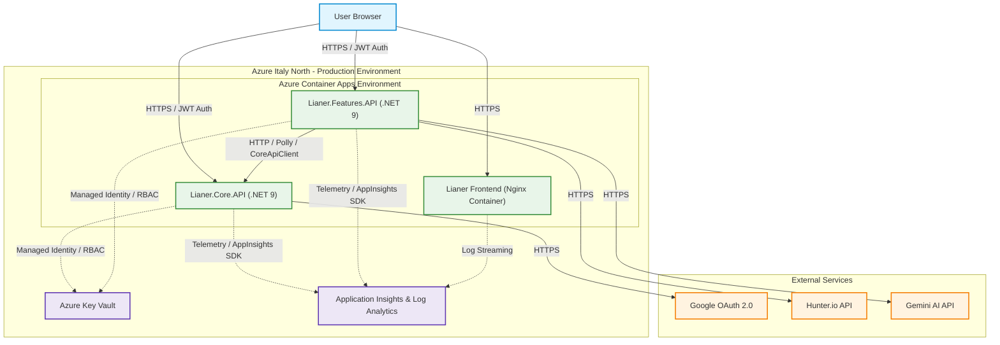
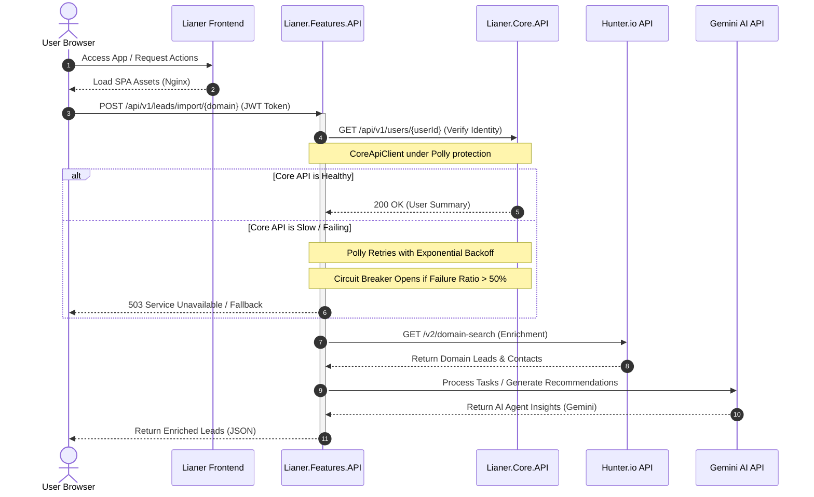

# Lianer Backend 2.0

<p align="left">
  <a href="README.md" title="English"></a>
  &nbsp;
  <a href="README.es.md" title="Español"></a>
  &nbsp;
  <a href="README.sv.md" title="Svenska"></a>
  &nbsp;
  <a href="README.de.md" title="Deutsch"></a>
  &nbsp;
  <a href="README.ko.md" title="한국어"></a>
  &nbsp;
  <a href="README.ja.md" title="日本語"></a>
  &nbsp;
  <a href="README.zh.md" title="中文"></a>
</p>

[Inglés](README.en.md) | [Español](README.es.md) | [Documentación](deployment.md) | [ADR](docs/adr/0001-choosing-azure-hosting.md) | [IA](README.es.md#función-impulsada-por-ia-integración-con-gemini-ai) | [Demo en vivo del frontend](https://lianer-frontend.icybush-5ce7e353.italynorth.azurecontainerapps.io)

Una arquitectura segura y distribuida de microservicios en ASP.NET Core 9, diseñada para despliegue en la nube. El sistema incluye autenticación JWT, integración con Google OAuth2, comunicación con APIs externas como Hunter.io y Gemini AI, integración sin contraseñas con Azure Key Vault, CI/CD, monitorización y despliegue fullstack en contenedores.

**Aplicación en vivo:** [Lianer Frontend App](https://lianer-frontend.icybush-5ce7e353.italynorth.azurecontainerapps.io)


---

## Tabla de contenidos

- [Despliegue y estado del sistema](#despliegue-y-estado-del-sistema)
- [Arquitectura](#arquitectura)
- [Funcionalidades](#funcionalidades)
- [Primeros pasos](#primeros-pasos)
- [Documentación de API](#documentación-de-api)
- [Seguridad](#seguridad)
- [Pruebas](#pruebas)
- [Pipeline CI/CD](#pipeline-cicd)
- [Patrones avanzados de diseño y resiliencia](#patrones-avanzados-de-diseño-y-resiliencia)
- [Team](#team)

---

## Despliegue y estado del sistema

El sistema está completamente contenerizado y desplegado en un entorno cloud unificado en Azure. Esta sección resume cómo se construye, protege, valida, monitoriza y publica la pila de aplicación en producción.

<details>
<summary><b>Contenerización y alojamiento en Azure</b></summary>

Para garantizar un entorno de producción reproducible, toda la pila de aplicación está contenerizada. `Lianer.Core.API` y `Lianer.Features.API` usan Dockerfiles multi-stage e imágenes runtime chiseled mínimas de .NET. Los servicios se ejecutan como el usuario no privilegiado `app` en el puerto **8080**, reduciendo la superficie de ataque y reforzando la defensa en profundidad. La SPA frontend se empaqueta en un contenedor Nginx no privilegiado. Azure Container Apps se eligió en lugar de Azure Static Web Apps por limitaciones regionales de Azure for Students.

See [deployment.md](deployment.md) and [ADR 0001: Choosing Azure Hosting](docs/adr/0001-choosing-azure-hosting.md) for full details.

<details>
<summary><b>Screenshots</b></summary>


*Azure Container Apps running status.*


*ACA environment variables configuration.*
</details>
</details>

<details>
<summary><b>Configuración segura y Key Vault</b></summary>

Los secretos de producción se eliminan del código fuente y se almacenan en Azure Key Vault. Azure Container Apps accede a ellos mediante Managed Identity y Azure RBAC con el rol `Key Vault Secrets User`. El desarrollo local puede usar User Secrets como fallback seguro mediante `DefaultAzureCredential()`.

<details>
<summary><b>Screenshots</b></summary>


*Key Vault RBAC role assignments.*


*Azure Key Vault secrets list.*
</details>
</details>

<details>
<summary><b>CI/CD</b></summary>

GitHub Actions valida cada pull request y despliega automáticamente después de merges a `main`. El pipeline usa OIDC Federated Credentials, construye imágenes de producción, las etiqueta con el SHA del commit, las sube a Azure Container Registry y actualiza Azure Container Apps en Italy North.
</details>

<details>
<summary><b>Observabilidad y monitorización</b></summary>

Application Insights y Log Analytics recopilan requests HTTP, tiempos de respuesta, códigos de estado, excepciones, llamadas a dependencias externas, logs y trazas de Application Map a través de toda la cadena de servicios.

<details>
<summary><b>Screenshots</b></summary>


*Distributed tracing map in Application Insights.*


*Live telemetry stream in Application Insights.*


*Average response time per endpoint query results.*


*Traffic trend query results.*


*Failed external requests dependency query.*
</details>
</details>

---

## Arquitectura

### System Architecture Map

El siguiente mapa muestra la infraestructura cloud y el flujo de solicitudes de la aplicación fullstack Lianer desplegada en Azure.



### Request and Resilience Flow

El siguiente diagrama de secuencia muestra cómo las solicitudes atraviesan el sistema, protegidas por Polly y enriquecidas con funcionalidad de Gemini AI.



<details>
<summary><b>Detalles de servicios y comunicación entre servicios</b></summary>

El sistema se divide en un frontend Vanilla JavaScript, `Lianer.Core.API` para usuarios, sesiones, contactos, actividades y notas, y `Lianer.Features.API` para leads, importaciones, tareas y funciones asistidas por IA.

### Endpoints de Core API

**User & Session Management**
- `POST /api/v1/users`
- `GET /api/v1/users`
- `GET /api/v1/users/{id}`
- `PUT /api/v1/users/{id}`
- `DELETE /api/v1/users/{id}`
- `POST /api/v1/sessions`
- `POST /api/v1/sessions/google`
- `GET /api/v1/sessions/google/url`

**Contacts Management**
- `GET /api/v1/contacts/{id}`
- `POST /api/v1/contacts`
- `PUT /api/v1/contacts/{id}`
- `DELETE /api/v1/contacts/{id}`

**Activities Management**
- `GET /api/v1/activities`
- `GET /api/v1/activities/{id}`
- `GET /api/v1/activities/user/{id}`
- `POST /api/v1/activities`
- `PUT /api/v1/activities`
- `DELETE /api/v1/activities/{id}`

**Activity Notes Management**
- `GET /api/v1/activities/{activityId}/notes`
- `GET /api/v1/activities/{activityId}/notes/{noteId}`
- `POST /api/v1/activities/{activityId}/notes`
- `PUT /api/v1/activities/{activityId}/notes/{noteId}`
- `DELETE /api/v1/activities/{activityId}/notes/{noteId}`

### Endpoints de Features API

- `GET /api/v1/leads`
- `GET /api/v1/leads/{id}/details`
- `GET /api/v1/leads/enrich/{domain}`
- `POST /api/v1/leads/import/{domain}`
- `PATCH /api/v1/leads/{leadId}/assign`
- `POST /api/v1/leads/prepare-test`

### Inter-service Communication

`Lianer.Features.API` se comunica con `Lianer.Core.API` mediante `CoreApiClient`, protegido por políticas de retry y circuit breaker de Polly.

<details>
<summary><b>Screenshot</b></summary>


*Terminal output showing successful communication between Core API and Features API.*
</details>
</details>

---

## Funcionalidades

<details>
<summary><b>Technical Feature List</b></summary>

### Diseño RESTful de API

- URLs de recursos en plural como `/api/v1/users` y `/api/v1/leads`
- Métodos HTTP correctos: GET, POST, PUT, PATCH, DELETE
- Códigos de estado estandarizados
- DTOs para separar modelos de base de datos y contratos de API
- Versionado de URL con `Asp.Versioning.Http`

### Seguridad

- JWT Bearer Authentication con HMAC-SHA256
- Hashing de contraseñas con BCrypt
- Google OAuth2 SSO con registro automático
- CORS estricto sin `AllowAnyOrigin()`
- Data Annotations y validación centralizada
- Control de propiedad para operaciones protegidas

### Rendimiento y caché

- MemoryCache para endpoints GET costosos
- Invalidación de caché en escrituras
- Exponential backoff con jitter
- Rate limiting de ventana fija
- Paginación y filtrado

### Integraciones externas

- Hunter.io para búsqueda de dominios y enriquecimiento de leads
- Google OAuth2 para SSO
- Google Gemini para categorización, insights y recomendaciones
- Azure Key Vault y User Secrets
- Políticas de resiliencia con Polly

<details>
<summary><b>Screenshot</b></summary>


*Scalar API documentation for bulk lead import.*
</details>
</details>

---

## Primeros pasos

<details>
<summary><b>Setup, Installation & Running Guide</b></summary>

### Requisitos previos

- .NET 9.0 SDK o superior
- Git
- Visual Studio, VS Code o Rider
- Credenciales de Google OAuth2
- Clave API de Hunter.io

### 1. Clonar el repositorio

```bash
git clone https://github.com/exikoz/Lianer-backend.git
cd Lianer-backend
```

### 2. Configurar User Secrets

**Core API:**

```bash
cd Lianer.Core.API

dotnet user-secrets set "JwtSettings:SecretKey" "MySecretKeyMustBeAtLeastThirtyTwoChars123!!"
dotnet user-secrets set "JwtSettings:Issuer" "LianerIssuer"
dotnet user-secrets set "JwtSettings:Audience" "LianerAudience"
dotnet user-secrets set "JwtSettings:ExpirationMinutes" "60"

dotnet user-secrets set "Google:Auth:ClientId" "YOUR_CLIENT_ID.apps.googleusercontent.com"
dotnet user-secrets set "Google:Auth:ClientSecret" "YOUR_CLIENT_SECRET"
dotnet user-secrets set "Google:Auth:RedirectUri" "http://localhost:3000/auth/callback"

dotnet user-secrets list
```

**Features API:**

```bash
cd ../Lianer.Features.API

dotnet user-secrets set "Hunter:ApiKey" "YOUR_HUNTER_API_KEY"

dotnet user-secrets list
```

### 3. Construir el proyecto

```bash
cd ..
dotnet build
```

### 4. Ejecutar los servicios

```bash
# Terminal 1: Core API
cd Lianer.Core.API
dotnet run --launch-profile https
# Listening on: https://localhost:5297

# Terminal 2: Features API
cd Lianer.Features.API
dotnet run --launch-profile https
# Listening on: https://localhost:5298
```

### Puertos

| Service | HTTP | HTTPS |
|---------|------|-------|
| Core API | 5297 | 7115 |
| Features API | 5266 | 7089 |
</details>

---

## Documentación de API

<details>
<summary><b>Scalar API Details & Verification</b></summary>

Ambos servicios exponen documentación interactiva con Scalar en modo desarrollo. Core API permite probar registro, login, Google SSO, endpoints protegidos con JWT, contactos, actividades y notas. Features API permite probar lead enrichment, importación masiva y leads enriquecidos con nombres de usuario desde Core API.

### Core API

**URL:** `https://localhost:5297/scalar/v1`


*Google OAuth2 endpoint testing in Scalar.*


*Successful registration of a new user in Core API.*

### Features API

**URL:** `https://localhost:5298/scalar/v1`


*Enriched lead list with usernames from Core API.*


*Successful import and enrichment of leads from Hunter.io in Features API.*
</details>

---

## Seguridad

<details>
<summary><b>Authentication, SSO, CORS & Key Vault</b></summary>

### JWT Bearer Authentication

El usuario se registra, inicia sesión, recibe un JWT con 60 minutos de vida y el cliente lo envía como `Authorization: Bearer {token}` al llamar endpoints protegidos.

```json
{
  "sub": "user-guid",
  "name": "John Doe",
  "email": "john@example.com",
  "userId": "user-guid",
  "exp": 1714838400
}
```

### Google OAuth2 SSO

Google OAuth2 obtiene una URL de autorización, redirige al usuario a Google, valida el token en Core API, registra automáticamente usuarios nuevos de Google y devuelve un JWT local.

### CORS Policy

La aplicación usa una lista explícita de orígenes permitidos y no utiliza `AllowAnyOrigin()`.

```csharp
builder.Services.AddCors(options =>
{
    options.AddPolicy("DefaultPolicy", policy =>
    {
        policy.WithOrigins(
                builder.Configuration.GetSection("Cors:AllowedOrigins").Get<string[]>()
                ?? ["http://localhost:5173", "http://localhost:3000"])
            .AllowAnyHeader()
            .AllowAnyMethod()
            .AllowCredentials();
    });
});
```

### Rate Limiting

```csharp
builder.Services.AddRateLimiter(options =>
{
    options.AddFixedWindowLimiter("fixed", limiterOptions =>
    {
        limiterOptions.PermitLimit = 100;
        limiterOptions.Window = TimeSpan.FromMinutes(1);
        limiterOptions.QueueLimit = 10;
    });
});

app.MapControllers().RequireRateLimiting("fixed");
```

### Azure Key Vault

En producción, los secretos se leen desde Azure Key Vault mediante Managed Identity y Azure RBAC. En local, User Secrets funciona como fallback seguro.


*Azure Key Vault secrets overview.*
</details>

---

## Pruebas

<details>
<summary><b>Testing Suite</b></summary>

El backend usa pruebas unitarias, pruebas de integración y validación de Dependency Injection para detectar errores de configuración temprano.

### Running Tests

```bash
# All tests
dotnet test

# Only unit tests
dotnet test --filter Category=Unit

# Only integration tests
dotnet test --filter Category=Integration

# With code coverage
dotnet test /p:CollectCoverage=true
```

### Dependency Injection Validation

```csharp
builder.Host.UseDefaultServiceProvider(options =>
{
    options.ValidateScopes = true;      // Prevents Captive Dependencies
    options.ValidateOnBuild = true;     // Prevents missing registrations
});
```
</details>

---

## Pipeline CI/CD

<details>
<summary><b>CI/CD Pipeline Architecture & Deployment</b></summary>

Los pull requests se validan con pruebas frontend, pruebas backend y dry-run Docker builds. Los merges a `main` disparan builds de imágenes, push a ACR, etiquetado con commit SHA y actualización de revisiones en Azure Container Apps.
</details>

---

## Patrones avanzados de diseño y resiliencia

<details>
<summary><b>Advanced Backend Features</b></summary>

El backend incluye middleware de excepciones personalizado, respuestas estilo ProblemDetails, retries con Polly, circuit breakers, MemoryCache, invalidación de caché, typed HTTP clients e integraciones externas.
</details>

---

## Flujo de prueba quirúrgico (End-to-End)

<details>
<summary><b>Verification Phases</b></summary>

El flujo end-to-end crea un usuario, inicia sesión, autoriza Scalar, importa leads, lista leads, asigna un lead y verifica que `assignedToName` aparezca en los detalles.

1. `POST /api/v1/users`
2. `POST /api/v1/sessions`
3. Authorize Scalar with BearerAuth.
4. `POST /api/v1/leads/import/microsoft.com`
5. `GET /api/v1/leads`
6. `PATCH /api/v1/leads/{leadId}/assign`
7. `GET /api/v1/leads/{leadId}/details`
</details>

---

## Observabilidad y monitorización

<details>
<summary><b>Observability & Monitoring Details</b></summary>

El entorno de producción envía telemetría, latencias, excepciones, logs y dependency calls a Application Insights y Log Analytics. `deployment.md` incluye runbooks y ejemplos KQL.
</details>

---

## Función impulsada por IA (integración con Gemini AI)

<details>
<summary><b>AI Feature Details</b></summary>

Features API integra Gemini AI mediante un agente server-side que ayuda a categorizar tasks/leads, generar insights y recomendaciones. La clave de Gemini se almacena en Azure Key Vault y se inyecta al iniciar.
</details>

---

## Team

**API Architects - .NET Team Malmö**

- [Joco Borghol](https://github.com/JocoBorghol) - Fullstack Developer
- [Alexander Jansson](https://github.com/alexanderjson) - Fullstack Developer
- [Hussein Hasnawy](https://github.com/exikoz) - Fullstack Developer

---

## Contact

Para preguntas o feedback, contacta con el equipo mediante GitHub Issues o crea un Pull Request.

**Repository:** [https://github.com/exikoz/Lianer-backend](https://github.com/exikoz/Lianer-backend)

---

## Verificación técnica (logs)

<details>
<summary><b>System Logs & Verification</b></summary>

### Caching & Invalidation

```text
info: GET /api/v1/leads called (Cache Check)
info: Cache miss. Fetching fresh data and enriching.
info: Saved 10 entities to in-memory store.
...
info: GET /api/v1/leads called (Cache Check)
info: Returning leads from cache.
```

### Resilience with Polly

```text
info: Polly[3]
      Execution attempt. Source: 'CoreApiClient-core-api-pipeline//Retry', 
      Operation Key: '', Result: '200', Attempt: '0', Execution Time: 19.3348ms
```

### Security & Error Handling

```text
warn: Login failed: Invalid password for email test@test.se
fail: Unhandled exception caught by middleware. Status: 401, Path: /api/v1/sessions
...
info: User authenticated successfully: 17c98dcb-9e66-4d3b-9eea-2508d7270839
info: JWT token generated for user: 17c98dcb-9e66-4d3b-9eea-2508d7270839
```
</details>
