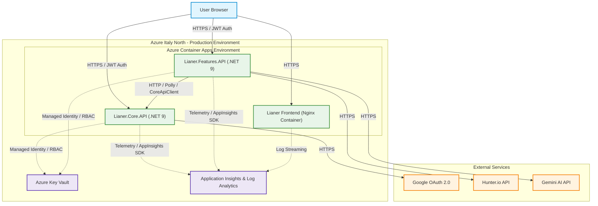
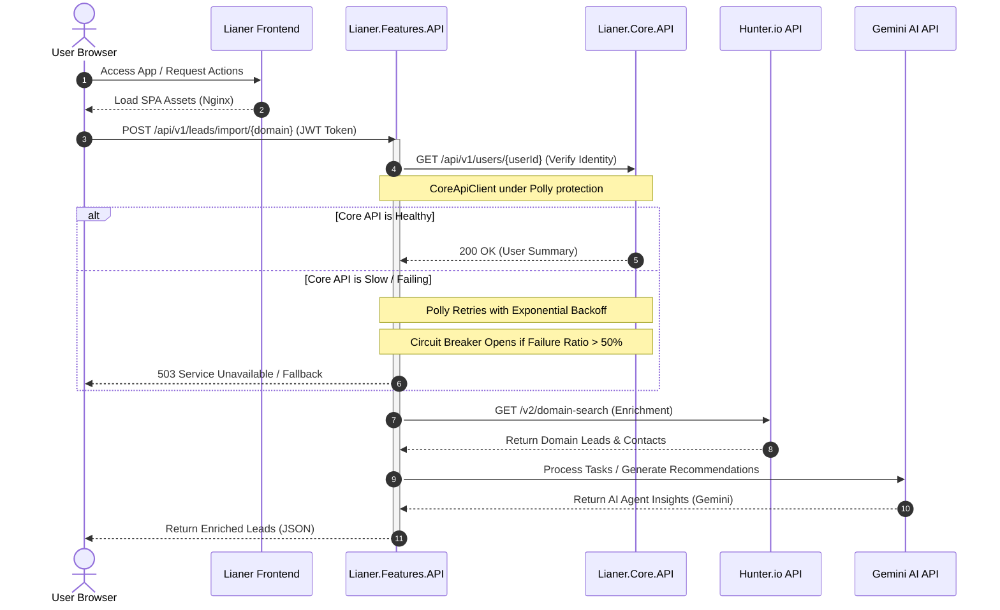

# Lianer Backend 2.0

<p align="left">
  <a href="README.en.md" title="English"></a>
  &nbsp;
  <a href="README.es.md" title="Español"></a>
  &nbsp;
  <a href="README.sv.md" title="Svenska"></a>
  &nbsp;
  <a href="README.de.md" title="Deutsch"></a>
  &nbsp;
  <a href="README.ko.md" title="한국어"></a>
  &nbsp;
  <a href="README.ja.md" title="日本語"></a>
  &nbsp;
  <a href="README.zh.md" title="中文"></a>
</p>

[英語](README.en.md) | [日本語](README.ja.md) | [ドキュメント](deployment.md) | [ADR](docs/adr/0001-choosing-azure-hosting.md) | [AI](README.ja.md#ai-駆動機能-gemini-ai-統合) | [フロントエンドのライブデモ](https://lianer-frontend.icybush-5ce7e353.italynorth.azurecontainerapps.io)

クラウドデプロイ向けに構築された、安全で分散型の ASP.NET Core 9 マイクロサービスアーキテクチャです。JWT 認証、Google OAuth2 統合、Hunter.io と Gemini AI との外部 API 通信、パスワードレス Azure Key Vault 統合、CI/CD、監視、コンテナ化されたフルスタックデプロイを含みます。

**ライブアプリケーション:** [Lianer Frontend App](https://lianer-frontend.icybush-5ce7e353.italynorth.azurecontainerapps.io)


---

## 目次

- [デプロイとシステム状態](#デプロイとシステム状態)
- [アーキテクチャ](#アーキテクチャ)
- [機能](#機能)
- [はじめに](#はじめに)
- [API ドキュメント](#api-ドキュメント)
- [セキュリティ](#セキュリティ)
- [テスト](#テスト)
- [CI/CD パイプライン](#cicd-パイプライン)
- [高度な設計とレジリエンスパターン](#高度な設計とレジリエンスパターン)
- [Team](#team)

---

## デプロイとシステム状態

システムは完全にコンテナ化され、統合された Azure クラウド環境にデプロイされています。このセクションでは、アプリケーションスタックがどのようにビルド、保護、品質保証、監視、本番リリースされるかをまとめます。

<details>
<summary><b>コンテナ化と Azure ホスティング</b></summary>

再現可能な本番環境を保証するため、アプリケーションスタック全体がコンテナ化されています。`Lianer.Core.API` と `Lianer.Features.API` は multi-stage Dockerfile と最小構成の .NET chiseled runtime image を使用します。サービスは非特権ユーザー `app` として **8080** ポートで動作し、攻撃対象領域を減らして defense in depth を強化します。フロントエンド SPA は非特権 Nginx コンテナとしてパッケージ化されています。Azure for Students のリージョン制限により、Azure Static Web Apps ではなく Azure Container Apps が選択されました。

See [deployment.md](deployment.md) and [ADR 0001: Choosing Azure Hosting](docs/adr/0001-choosing-azure-hosting.md) for full details.

<details>
<summary><b>Screenshots</b></summary>


*Azure Container Apps running status.*


*ACA environment variables configuration.*
</details>
</details>

<details>
<summary><b>安全な設定と Key Vault</b></summary>

本番用シークレットはソースコードから削除され、Azure Key Vault に保存されます。Azure Container Apps は Managed Identity と Azure RBAC の `Key Vault Secrets User` ロールを使ってシークレットにアクセスします。ローカル開発では `DefaultAzureCredential()` ロジックにより User Secrets へ安全にフォールバックできます。

<details>
<summary><b>Screenshots</b></summary>


*Key Vault RBAC role assignments.*


*Azure Key Vault secrets list.*
</details>
</details>

<details>
<summary><b>CI/CD</b></summary>

GitHub Actions はすべての pull request を検証し、`main` への merge 後に自動デプロイします。デプロイパイプラインは OIDC Federated Credentials を使用し、本番 image をビルドし、GitHub commit SHA でタグ付けし、Azure Container Registry に push して Italy North の Azure Container Apps を更新します。
</details>

<details>
<summary><b>Observability と監視</b></summary>

Application Insights と Log Analytics は、HTTP request、応答時間、ステータスコード、例外、外部 dependency call、ログ、Application Map trace をサービスチェーン全体から収集します。

<details>
<summary><b>Screenshots</b></summary>


*Distributed tracing map in Application Insights.*


*Live telemetry stream in Application Insights.*


*Average response time per endpoint query results.*


*Traffic trend query results.*


*Failed external requests dependency query.*
</details>
</details>

---

## アーキテクチャ

### System Architecture Map

次の図は、Azure にデプロイされた Lianer フルスタックアプリケーションのクラウドインフラと request flow を示します。



### Request and Resilience Flow

次の sequence diagram は、request が Polly のレジリエンス機構で保護され、Gemini AI 機能で拡張されながらシステムを通過する流れを示します。



<details>
<summary><b>サービス詳細とサービス間通信</b></summary>

システムは Vanilla JavaScript フロントエンド、ユーザー/セッション/連絡先/活動/ノートを担当する `Lianer.Core.API`、leads/import/task 処理/AI 支援機能を担当する `Lianer.Features.API` に分割されています。

### Core API エンドポイント

**User & Session Management**
- `POST /api/v1/users`
- `GET /api/v1/users`
- `GET /api/v1/users/{id}`
- `PUT /api/v1/users/{id}`
- `DELETE /api/v1/users/{id}`
- `POST /api/v1/sessions`
- `POST /api/v1/sessions/google`
- `GET /api/v1/sessions/google/url`

**Contacts Management**
- `GET /api/v1/contacts/{id}`
- `POST /api/v1/contacts`
- `PUT /api/v1/contacts/{id}`
- `DELETE /api/v1/contacts/{id}`

**Activities Management**
- `GET /api/v1/activities`
- `GET /api/v1/activities/{id}`
- `GET /api/v1/activities/user/{id}`
- `POST /api/v1/activities`
- `PUT /api/v1/activities`
- `DELETE /api/v1/activities/{id}`

**Activity Notes Management**
- `GET /api/v1/activities/{activityId}/notes`
- `GET /api/v1/activities/{activityId}/notes/{noteId}`
- `POST /api/v1/activities/{activityId}/notes`
- `PUT /api/v1/activities/{activityId}/notes/{noteId}`
- `DELETE /api/v1/activities/{activityId}/notes/{noteId}`

### Features API エンドポイント

- `GET /api/v1/leads`
- `GET /api/v1/leads/{id}/details`
- `GET /api/v1/leads/enrich/{domain}`
- `POST /api/v1/leads/import/{domain}`
- `PATCH /api/v1/leads/{leadId}/assign`
- `POST /api/v1/leads/prepare-test`

### Inter-service Communication

`Lianer.Features.API` は、Polly の retry と circuit-breaker policy で保護された `CoreApiClient` を通じて `Lianer.Core.API` と通信します。

<details>
<summary><b>Screenshot</b></summary>


*Terminal output showing successful communication between Core API and Features API.*
</details>
</details>

---

## 機能

<details>
<summary><b>Technical Feature List</b></summary>

### RESTful API 設計

- `/api/v1/users` や `/api/v1/leads` のような複数形リソース URL
- GET, POST, PUT, PATCH, DELETE の正しい HTTP メソッド
- 標準化されたステータスコード
- データベースモデルと API contract を分離する DTO
- `Asp.Versioning.Http` による URL versioning

### セキュリティ

- HMAC-SHA256 による JWT Bearer Authentication
- BCrypt による password hashing
- 自動登録付き Google OAuth2 SSO
- `AllowAnyOrigin()` を使わない厳格な CORS
- Data Annotations と集中 validation
- 保護された操作の ownership check

### パフォーマンスとキャッシュ

- 高コスト GET endpoint 用 MemoryCache
- 書き込み時の cache invalidation
- jitter 付き exponential backoff
- fixed-window rate limiting
- pagination と filtering

### 外部統合

- domain search と lead enrichment 用 Hunter.io
- SSO 用 Google OAuth2
- categorization, insights, recommendations 用 Google Gemini
- Azure Key Vault と User Secrets
- Polly resilience policies

<details>
<summary><b>Screenshot</b></summary>


*Scalar API documentation for bulk lead import.*
</details>
</details>

---

## はじめに

<details>
<summary><b>Setup, Installation & Running Guide</b></summary>

### 前提条件

- .NET 9.0 SDK 以降
- Git
- Visual Studio, VS Code, または Rider
- Google OAuth2 credentials
- Hunter.io API key

### 1. リポジトリを clone

```bash
git clone https://github.com/exikoz/Lianer-backend.git
cd Lianer-backend
```

### 2. User Secrets を設定

**Core API:**

```bash
cd Lianer.Core.API

dotnet user-secrets set "JwtSettings:SecretKey" "MySecretKeyMustBeAtLeastThirtyTwoChars123!!"
dotnet user-secrets set "JwtSettings:Issuer" "LianerIssuer"
dotnet user-secrets set "JwtSettings:Audience" "LianerAudience"
dotnet user-secrets set "JwtSettings:ExpirationMinutes" "60"

dotnet user-secrets set "Google:Auth:ClientId" "YOUR_CLIENT_ID.apps.googleusercontent.com"
dotnet user-secrets set "Google:Auth:ClientSecret" "YOUR_CLIENT_SECRET"
dotnet user-secrets set "Google:Auth:RedirectUri" "http://localhost:3000/auth/callback"

dotnet user-secrets list
```

**Features API:**

```bash
cd ../Lianer.Features.API

dotnet user-secrets set "Hunter:ApiKey" "YOUR_HUNTER_API_KEY"

dotnet user-secrets list
```

### 3. プロジェクトをビルド

```bash
cd ..
dotnet build
```

### 4. サービスを実行

```bash
# Terminal 1: Core API
cd Lianer.Core.API
dotnet run --launch-profile https
# Listening on: https://localhost:5297

# Terminal 2: Features API
cd Lianer.Features.API
dotnet run --launch-profile https
# Listening on: https://localhost:5298
```

### ポート

| Service | HTTP | HTTPS |
|---------|------|-------|
| Core API | 5297 | 7115 |
| Features API | 5266 | 7089 |
</details>

---

## API ドキュメント

<details>
<summary><b>Scalar API Details & Verification</b></summary>

両方のサービスは development mode で Scalar によるインタラクティブ API ドキュメントを公開します。Core API では registration, login, Google SSO, JWT 保護 endpoint, contacts, activities, notes をテストできます。Features API では lead enrichment, bulk import, Core API から取得したユーザー名付き enriched leads をテストできます。

### Core API

**URL:** `https://localhost:5297/scalar/v1`


*Google OAuth2 endpoint testing in Scalar.*


*Successful registration of a new user in Core API.*

### Features API

**URL:** `https://localhost:5298/scalar/v1`


*Enriched lead list with usernames from Core API.*


*Successful import and enrichment of leads from Hunter.io in Features API.*
</details>

---

## セキュリティ

<details>
<summary><b>Authentication, SSO, CORS & Key Vault</b></summary>

### JWT Bearer Authentication

ユーザーは登録してログインし、60 分有効な JWT を受け取り、クライアントは保護 endpoint 呼び出し時に `Authorization: Bearer {token}` として送信します。

```json
{
  "sub": "user-guid",
  "name": "John Doe",
  "email": "john@example.com",
  "userId": "user-guid",
  "exp": 1714838400
}
```

### Google OAuth2 SSO

Google OAuth2 は authorization URL を取得し、ユーザーを Google にリダイレクトし、Core API で返却 token を検証し、初回 Google ユーザーを自動登録して local JWT を返します。

### CORS Policy

アプリケーションは明示的な CORS allow-list を使用し、`AllowAnyOrigin()` は使用しません。

```csharp
builder.Services.AddCors(options =>
{
    options.AddPolicy("DefaultPolicy", policy =>
    {
        policy.WithOrigins(
                builder.Configuration.GetSection("Cors:AllowedOrigins").Get<string[]>()
                ?? ["http://localhost:5173", "http://localhost:3000"])
            .AllowAnyHeader()
            .AllowAnyMethod()
            .AllowCredentials();
    });
});
```

### Rate Limiting

```csharp
builder.Services.AddRateLimiter(options =>
{
    options.AddFixedWindowLimiter("fixed", limiterOptions =>
    {
        limiterOptions.PermitLimit = 100;
        limiterOptions.Window = TimeSpan.FromMinutes(1);
        limiterOptions.QueueLimit = 10;
    });
});

app.MapControllers().RequireRateLimiting("fixed");
```

### Azure Key Vault

本番シークレットは Managed Identity と Azure RBAC により Azure Key Vault から読み込まれます。ローカル開発では User Secrets が安全な fallback になります。


*Azure Key Vault secrets overview.*
</details>

---

## テスト

<details>
<summary><b>Testing Suite</b></summary>

バックエンドは unit test、integration test、Dependency Injection validation を使用して設定エラーを早期に検出します。

### Running Tests

```bash
# All tests
dotnet test

# Only unit tests
dotnet test --filter Category=Unit

# Only integration tests
dotnet test --filter Category=Integration

# With code coverage
dotnet test /p:CollectCoverage=true
```

### Dependency Injection Validation

```csharp
builder.Host.UseDefaultServiceProvider(options =>
{
    options.ValidateScopes = true;      // Prevents Captive Dependencies
    options.ValidateOnBuild = true;     // Prevents missing registrations
});
```
</details>

---

## CI/CD パイプライン

<details>
<summary><b>CI/CD Pipeline Architecture & Deployment</b></summary>

Pull request は frontend tests、backend tests、dry-run Docker builds で検証されます。`main` への merge は image build、ACR push、commit-SHA tagging、Azure Container Apps revision update をトリガーします。
</details>

---

## 高度な設計とレジリエンスパターン

<details>
<summary><b>Advanced Backend Features</b></summary>

バックエンドには custom exception middleware、ProblemDetails 風 responses、Polly retries、circuit breakers、MemoryCache、cache invalidation、typed HTTP clients、external API integrations が含まれます。
</details>

---

## 外科的テストフロー (End-to-End)

<details>
<summary><b>Verification Phases</b></summary>

End-to-end 検証フローは、ユーザー作成、ログイン、Scalar 認可、leads import、leads list、lead assign、details での `assignedToName` 確認で構成されます。

1. `POST /api/v1/users`
2. `POST /api/v1/sessions`
3. Authorize Scalar with BearerAuth.
4. `POST /api/v1/leads/import/microsoft.com`
5. `GET /api/v1/leads`
6. `PATCH /api/v1/leads/{leadId}/assign`
7. `GET /api/v1/leads/{leadId}/details`
</details>

---

## Observability と監視

<details>
<summary><b>Observability & Monitoring Details</b></summary>

本番環境は telemetry、latency、exceptions、logs、dependency calls を Application Insights と Log Analytics に送信します。`deployment.md` には runbook 手順と KQL 例が含まれます。
</details>

---

## AI 駆動機能 (Gemini AI 統合)

<details>
<summary><b>AI Feature Details</b></summary>

Features API は server-side AI agent を通じて Gemini AI を統合し、tasks/leads の categorization、insights、recommendations を支援します。Gemini key は Azure Key Vault に保存され、startup 時に注入されます。
</details>

---

## Team

**API Architects - .NET Team Malmö**

- [Joco Borghol](https://github.com/JocoBorghol) - Fullstack Developer
- [Alexander Jansson](https://github.com/alexanderjson) - Fullstack Developer
- [Hussein Hasnawy](https://github.com/exikoz) - Fullstack Developer

---

## Contact

質問やフィードバックは GitHub Issues でチームに連絡するか、Pull Request を作成してください。

**Repository:** [https://github.com/exikoz/Lianer-backend](https://github.com/exikoz/Lianer-backend)

---

## 技術検証 (ログ)

<details>
<summary><b>System Logs & Verification</b></summary>

### Caching & Invalidation

```text
info: GET /api/v1/leads called (Cache Check)
info: Cache miss. Fetching fresh data and enriching.
info: Saved 10 entities to in-memory store.
...
info: GET /api/v1/leads called (Cache Check)
info: Returning leads from cache.
```

### Resilience with Polly

```text
info: Polly[3]
      Execution attempt. Source: 'CoreApiClient-core-api-pipeline//Retry', 
      Operation Key: '', Result: '200', Attempt: '0', Execution Time: 19.3348ms
```

### Security & Error Handling

```text
warn: Login failed: Invalid password for email test@test.se
fail: Unhandled exception caught by middleware. Status: 401, Path: /api/v1/sessions
...
info: User authenticated successfully: 17c98dcb-9e66-4d3b-9eea-2508d7270839
info: JWT token generated for user: 17c98dcb-9e66-4d3b-9eea-2508d7270839
```
</details>
