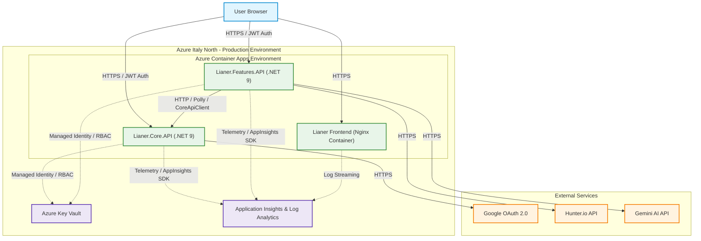
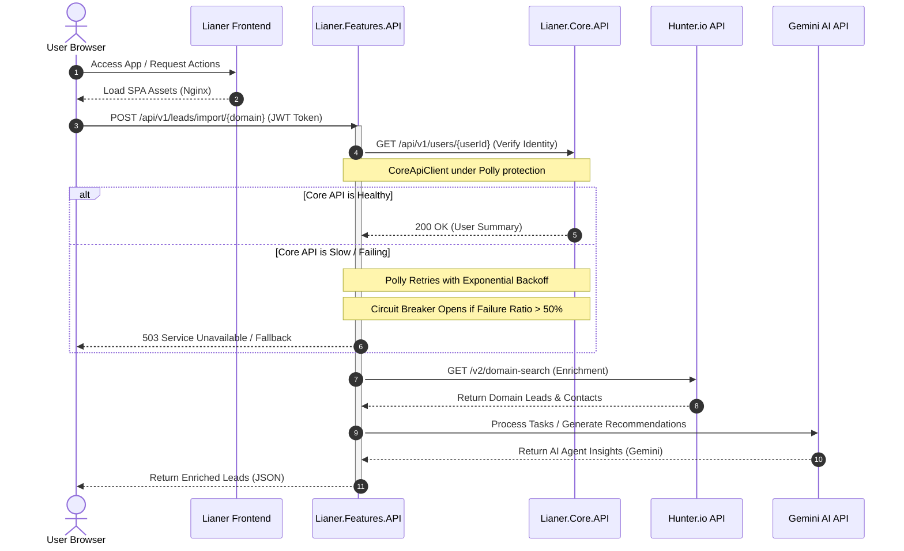

# Lianer Backend 2.0

<p align="left">
  <a href="README.md" title="English"></a>
  &nbsp;
  <a href="README.es.md" title="Español"></a>
  &nbsp;
  <a href="README.sv.md" title="Svenska"></a>
  &nbsp;
  <a href="README.de.md" title="Deutsch"></a>
  &nbsp;
  <a href="README.ko.md" title="한국어"></a>
  &nbsp;
  <a href="README.ja.md" title="日本語"></a>
  &nbsp;
  <a href="README.zh.md" title="中文"></a>
</p>

[영어](README.en.md) | [한국어](README.ko.md) | [문서](deployment.md) | [ADR](docs/adr/0001-choosing-azure-hosting.md) | [AI](README.ko.md#ai-기반-기능-gemini-ai-통합) | [프론트엔드 라이브 데모](https://lianer-frontend.icybush-5ce7e353.italynorth.azurecontainerapps.io)

클라우드 배포를 위해 설계된 안전한 분산 ASP.NET Core 9 마이크로서비스 아키텍처입니다. JWT 인증, Google OAuth2 통합, Hunter.io 및 Gemini AI와의 외부 API 통신, 비밀번호 없는 Azure Key Vault 통합, CI/CD, 모니터링, 컨테이너 기반 풀스택 배포를 포함합니다.

**라이브 애플리케이션:** [Lianer Frontend App](https://lianer-frontend.icybush-5ce7e353.italynorth.azurecontainerapps.io)


---

## 목차

- [배포 및 시스템 상태](#배포-및-시스템-상태)
- [아키텍처](#아키텍처)
- [기능](#기능)
- [시작하기](#시작하기)
- [API 문서](#api-문서)
- [보안](#보안)
- [테스트](#테스트)
- [CI/CD 파이프라인](#cicd-파이프라인)
- [고급 설계 및 복원력 패턴](#고급-설계-및-복원력-패턴)
- [Team](#team)

---

## 배포 및 시스템 상태

시스템은 완전히 컨테이너화되어 통합 Azure 클라우드 환경에 배포됩니다. 이 섹션은 애플리케이션 스택이 어떻게 빌드, 보안 처리, 품질 검증, 모니터링 및 프로덕션 릴리스되는지 요약합니다.

<details>
<summary><b>컨테이너화 및 Azure 호스팅</b></summary>

재현 가능한 프로덕션 환경을 보장하기 위해 전체 애플리케이션 스택은 컨테이너화되어 있습니다. `Lianer.Core.API`와 `Lianer.Features.API`는 multi-stage Dockerfile과 최소 .NET chiseled runtime 이미지를 사용합니다. 서비스는 비권한 사용자 `app`으로 **8080** 포트에서 실행되어 공격 표면을 줄이고 defense in depth를 강화합니다. 프론트엔드 SPA는 비권한 Nginx 컨테이너로 패키징됩니다. Azure for Students의 지역 제한 때문에 Azure Static Web Apps 대신 Azure Container Apps를 선택했습니다.

See [deployment.md](deployment.md) and [ADR 0001: Choosing Azure Hosting](docs/adr/0001-choosing-azure-hosting.md) for full details.

<details>
<summary><b>Screenshots</b></summary>


*Azure Container Apps running status.*


*ACA environment variables configuration.*
</details>
</details>

<details>
<summary><b>안전한 구성 및 Key Vault</b></summary>

프로덕션 비밀 값은 소스 코드에서 제거되고 Azure Key Vault에 저장됩니다. Azure Container Apps는 Managed Identity와 Azure RBAC의 `Key Vault Secrets User` 역할을 통해 비밀 값에 접근합니다. 로컬 개발은 `DefaultAzureCredential()` 로직을 통해 User Secrets로 안전하게 fallback할 수 있습니다.

<details>
<summary><b>Screenshots</b></summary>


*Key Vault RBAC role assignments.*


*Azure Key Vault secrets list.*
</details>
</details>

<details>
<summary><b>CI/CD</b></summary>

GitHub Actions는 모든 pull request를 검증하고 `main` 병합 후 자동으로 배포합니다. 배포 파이프라인은 OIDC Federated Credentials를 사용하고, 프로덕션 이미지를 빌드하며, GitHub commit SHA로 태그를 지정하고, Azure Container Registry에 push한 뒤 Italy North의 Azure Container Apps를 업데이트합니다.
</details>

<details>
<summary><b>관측성 및 모니터링</b></summary>

Application Insights와 Log Analytics는 HTTP 요청, 응답 시간, 상태 코드, 예외, 외부 dependency call, 로그, Application Map trace를 전체 서비스 체인에서 수집합니다.

<details>
<summary><b>Screenshots</b></summary>


*Distributed tracing map in Application Insights.*


*Live telemetry stream in Application Insights.*


*Average response time per endpoint query results.*


*Traffic trend query results.*


*Failed external requests dependency query.*
</details>
</details>

---

## 아키텍처

### System Architecture Map

다음 지도는 Azure에 배포된 Lianer 풀스택 애플리케이션의 클라우드 인프라와 request 흐름을 보여줍니다.



### Request and Resilience Flow

다음 시퀀스 다이어그램은 요청이 Polly 복원력 메커니즘으로 보호되고 Gemini AI 기능으로 보강되며 시스템을 통과하는 방식을 보여줍니다.



<details>
<summary><b>서비스 세부 정보 및 서비스 간 통신</b></summary>

시스템은 Vanilla JavaScript 프론트엔드, 사용자/세션/연락처/활동/노트를 담당하는 `Lianer.Core.API`, 그리고 leads/import/task 처리/AI 보조 기능을 담당하는 `Lianer.Features.API`로 나뉩니다.

### Core API 엔드포인트

**User & Session Management**
- `POST /api/v1/users`
- `GET /api/v1/users`
- `GET /api/v1/users/{id}`
- `PUT /api/v1/users/{id}`
- `DELETE /api/v1/users/{id}`
- `POST /api/v1/sessions`
- `POST /api/v1/sessions/google`
- `GET /api/v1/sessions/google/url`

**Contacts Management**
- `GET /api/v1/contacts/{id}`
- `POST /api/v1/contacts`
- `PUT /api/v1/contacts/{id}`
- `DELETE /api/v1/contacts/{id}`

**Activities Management**
- `GET /api/v1/activities`
- `GET /api/v1/activities/{id}`
- `GET /api/v1/activities/user/{id}`
- `POST /api/v1/activities`
- `PUT /api/v1/activities`
- `DELETE /api/v1/activities/{id}`

**Activity Notes Management**
- `GET /api/v1/activities/{activityId}/notes`
- `GET /api/v1/activities/{activityId}/notes/{noteId}`
- `POST /api/v1/activities/{activityId}/notes`
- `PUT /api/v1/activities/{activityId}/notes/{noteId}`
- `DELETE /api/v1/activities/{activityId}/notes/{noteId}`

### Features API 엔드포인트

- `GET /api/v1/leads`
- `GET /api/v1/leads/{id}/details`
- `GET /api/v1/leads/enrich/{domain}`
- `POST /api/v1/leads/import/{domain}`
- `PATCH /api/v1/leads/{leadId}/assign`
- `POST /api/v1/leads/prepare-test`

### Inter-service Communication

`Lianer.Features.API`는 Polly retry 및 circuit-breaker policy로 보호되는 `CoreApiClient`를 통해 `Lianer.Core.API`와 통신합니다.

<details>
<summary><b>Screenshot</b></summary>


*Terminal output showing successful communication between Core API and Features API.*
</details>
</details>

---

## 기능

<details>
<summary><b>Technical Feature List</b></summary>

### RESTful API 설계

- `/api/v1/users`, `/api/v1/leads` 같은 복수형 리소스 URL
- GET, POST, PUT, PATCH, DELETE의 올바른 HTTP 메서드 사용
- 표준화된 상태 코드
- 데이터베이스 모델과 API 계약을 분리하는 DTO
- `Asp.Versioning.Http` 기반 URL 버전 관리

### 보안

- HMAC-SHA256 기반 JWT Bearer Authentication
- BCrypt 비밀번호 해싱
- 자동 등록을 포함한 Google OAuth2 SSO
- `AllowAnyOrigin()` 없는 엄격한 CORS
- Data Annotations 및 중앙 집중식 검증
- 보호된 작업에 대한 소유권 검사

### 성능 및 캐싱

- 비용이 큰 GET 엔드포인트용 MemoryCache
- 쓰기 작업 시 캐시 무효화
- jitter가 포함된 exponential backoff
- fixed-window rate limiting
- 페이지네이션 및 필터링

### 외부 통합

- 도메인 검색 및 lead enrichment용 Hunter.io
- SSO용 Google OAuth2
- 분류, insight, recommendation용 Google Gemini
- Azure Key Vault 및 User Secrets
- Polly 복원력 policy

<details>
<summary><b>Screenshot</b></summary>


*Scalar API documentation for bulk lead import.*
</details>
</details>

---

## 시작하기

<details>
<summary><b>Setup, Installation & Running Guide</b></summary>

### 필수 조건

- .NET 9.0 SDK 이상
- Git
- Visual Studio, VS Code 또는 Rider
- Google OAuth2 자격 증명
- Hunter.io API 키

### 1. 저장소 클론

```bash
git clone https://github.com/exikoz/Lianer-backend.git
cd Lianer-backend
```

### 2. User Secrets 구성

**Core API:**

```bash
cd Lianer.Core.API

dotnet user-secrets set "JwtSettings:SecretKey" "MySecretKeyMustBeAtLeastThirtyTwoChars123!!"
dotnet user-secrets set "JwtSettings:Issuer" "LianerIssuer"
dotnet user-secrets set "JwtSettings:Audience" "LianerAudience"
dotnet user-secrets set "JwtSettings:ExpirationMinutes" "60"

dotnet user-secrets set "Google:Auth:ClientId" "YOUR_CLIENT_ID.apps.googleusercontent.com"
dotnet user-secrets set "Google:Auth:ClientSecret" "YOUR_CLIENT_SECRET"
dotnet user-secrets set "Google:Auth:RedirectUri" "http://localhost:3000/auth/callback"

dotnet user-secrets list
```

**Features API:**

```bash
cd ../Lianer.Features.API

dotnet user-secrets set "Hunter:ApiKey" "YOUR_HUNTER_API_KEY"

dotnet user-secrets list
```

### 3. 프로젝트 빌드

```bash
cd ..
dotnet build
```

### 4. 서비스 실행

```bash
# Terminal 1: Core API
cd Lianer.Core.API
dotnet run --launch-profile https
# Listening on: https://localhost:5297

# Terminal 2: Features API
cd Lianer.Features.API
dotnet run --launch-profile https
# Listening on: https://localhost:5298
```

### 포트

| Service | HTTP | HTTPS |
|---------|------|-------|
| Core API | 5297 | 7115 |
| Features API | 5266 | 7089 |
</details>

---

## API 문서

<details>
<summary><b>Scalar API Details & Verification</b></summary>

두 서비스 모두 development mode에서 Scalar를 통한 대화형 API 문서를 제공합니다. Core API에서는 registration, login, Google SSO, JWT 보호 엔드포인트, contacts, activities, notes를 테스트할 수 있습니다. Features API에서는 lead enrichment, bulk import, Core API에서 가져온 사용자 이름이 포함된 enriched leads를 테스트할 수 있습니다.

### Core API

**URL:** `https://localhost:5297/scalar/v1`


*Google OAuth2 endpoint testing in Scalar.*


*Successful registration of a new user in Core API.*

### Features API

**URL:** `https://localhost:5298/scalar/v1`


*Enriched lead list with usernames from Core API.*


*Successful import and enrichment of leads from Hunter.io in Features API.*
</details>

---

## 보안

<details>
<summary><b>Authentication, SSO, CORS & Key Vault</b></summary>

### JWT Bearer Authentication

사용자는 등록하고 로그인한 뒤 60분 수명의 JWT를 받으며, 클라이언트는 보호된 엔드포인트 호출 시 `Authorization: Bearer {token}`으로 전송합니다.

```json
{
  "sub": "user-guid",
  "name": "John Doe",
  "email": "john@example.com",
  "userId": "user-guid",
  "exp": 1714838400
}
```

### Google OAuth2 SSO

Google OAuth2는 authorization URL을 가져오고, 사용자를 Google로 리디렉션하며, Core API에서 반환된 토큰을 검증하고, 최초 Google 사용자를 자동 등록한 뒤 local JWT를 반환합니다.

### CORS Policy

애플리케이션은 명시적인 CORS allow-list를 사용하며 `AllowAnyOrigin()`을 사용하지 않습니다.

```csharp
builder.Services.AddCors(options =>
{
    options.AddPolicy("DefaultPolicy", policy =>
    {
        policy.WithOrigins(
                builder.Configuration.GetSection("Cors:AllowedOrigins").Get<string[]>()
                ?? ["http://localhost:5173", "http://localhost:3000"])
            .AllowAnyHeader()
            .AllowAnyMethod()
            .AllowCredentials();
    });
});
```

### Rate Limiting

```csharp
builder.Services.AddRateLimiter(options =>
{
    options.AddFixedWindowLimiter("fixed", limiterOptions =>
    {
        limiterOptions.PermitLimit = 100;
        limiterOptions.Window = TimeSpan.FromMinutes(1);
        limiterOptions.QueueLimit = 10;
    });
});

app.MapControllers().RequireRateLimiting("fixed");
```

### Azure Key Vault

프로덕션 비밀 값은 Managed Identity와 Azure RBAC를 통해 Azure Key Vault에서 읽습니다. 로컬 개발은 User Secrets를 안전한 fallback으로 사용합니다.


*Azure Key Vault secrets overview.*
</details>

---

## 테스트

<details>
<summary><b>Testing Suite</b></summary>

백엔드는 unit test, integration test, Dependency Injection validation을 사용하여 구성 오류를 조기에 탐지합니다.

### Running Tests

```bash
# All tests
dotnet test

# Only unit tests
dotnet test --filter Category=Unit

# Only integration tests
dotnet test --filter Category=Integration

# With code coverage
dotnet test /p:CollectCoverage=true
```

### Dependency Injection Validation

```csharp
builder.Host.UseDefaultServiceProvider(options =>
{
    options.ValidateScopes = true;      // Prevents Captive Dependencies
    options.ValidateOnBuild = true;     // Prevents missing registrations
});
```
</details>

---

## CI/CD 파이프라인

<details>
<summary><b>CI/CD Pipeline Architecture & Deployment</b></summary>

Pull request는 frontend test, backend test, dry-run Docker build로 검증됩니다. `main` 병합은 image build, ACR push, commit-SHA tagging, Azure Container Apps revision update를 트리거합니다.
</details>

---

## 고급 설계 및 복원력 패턴

<details>
<summary><b>Advanced Backend Features</b></summary>

백엔드는 custom exception middleware, ProblemDetails 스타일 응답, Polly retries, circuit breakers, MemoryCache, cache invalidation, typed HTTP clients, external API integration을 포함합니다.
</details>

---

## 수술식 테스트 플로우 (End-to-End)

<details>
<summary><b>Verification Phases</b></summary>

End-to-end 검증 흐름은 사용자 생성, 로그인, Scalar 인증, leads import, leads list 조회, lead assign, 그리고 details에서 `assignedToName` 확인으로 구성됩니다.

1. `POST /api/v1/users`
2. `POST /api/v1/sessions`
3. Authorize Scalar with BearerAuth.
4. `POST /api/v1/leads/import/microsoft.com`
5. `GET /api/v1/leads`
6. `PATCH /api/v1/leads/{leadId}/assign`
7. `GET /api/v1/leads/{leadId}/details`
</details>

---

## 관측성 및 모니터링

<details>
<summary><b>Observability & Monitoring Details</b></summary>

프로덕션 환경은 telemetry, latency, exceptions, logs, dependency calls를 Application Insights와 Log Analytics로 스트리밍합니다. `deployment.md`에는 runbook 단계와 KQL 예제가 포함되어 있습니다.
</details>

---

## AI 기반 기능 (Gemini AI 통합)

<details>
<summary><b>AI Feature Details</b></summary>

Features API는 server-side AI agent를 통해 Gemini AI를 통합하여 tasks/leads 분류, insights 생성, recommendations 제공을 지원합니다. Gemini key는 Azure Key Vault에 저장되고 startup 시 주입됩니다.
</details>

---

## Team

**API Architects - .NET Team Malmö**

- [Joco Borghol](https://github.com/JocoBorghol) - Fullstack Developer
- [Alexander Jansson](https://github.com/alexanderjson) - Fullstack Developer
- [Hussein Hasnawy](https://github.com/exikoz) - Fullstack Developer

---

## Contact

질문이나 피드백은 GitHub Issues를 통해 팀에 전달하거나 Pull Request를 생성하세요.

**Repository:** [https://github.com/exikoz/Lianer-backend](https://github.com/exikoz/Lianer-backend)

---

## 기술 검증 (로그)

<details>
<summary><b>System Logs & Verification</b></summary>

### Caching & Invalidation

```text
info: GET /api/v1/leads called (Cache Check)
info: Cache miss. Fetching fresh data and enriching.
info: Saved 10 entities to in-memory store.
...
info: GET /api/v1/leads called (Cache Check)
info: Returning leads from cache.
```

### Resilience with Polly

```text
info: Polly[3]
      Execution attempt. Source: 'CoreApiClient-core-api-pipeline//Retry', 
      Operation Key: '', Result: '200', Attempt: '0', Execution Time: 19.3348ms
```

### Security & Error Handling

```text
warn: Login failed: Invalid password for email test@test.se
fail: Unhandled exception caught by middleware. Status: 401, Path: /api/v1/sessions
...
info: User authenticated successfully: 17c98dcb-9e66-4d3b-9eea-2508d7270839
info: JWT token generated for user: 17c98dcb-9e66-4d3b-9eea-2508d7270839
```
</details>
