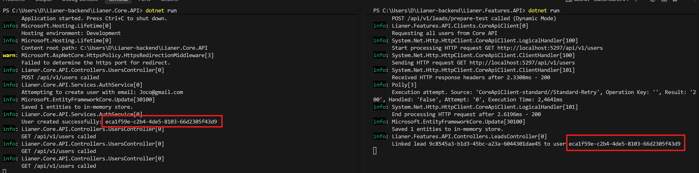
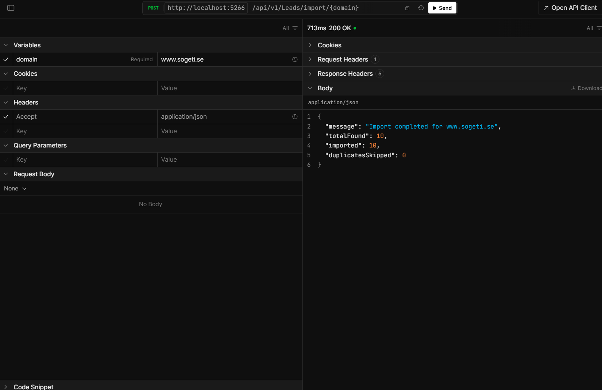
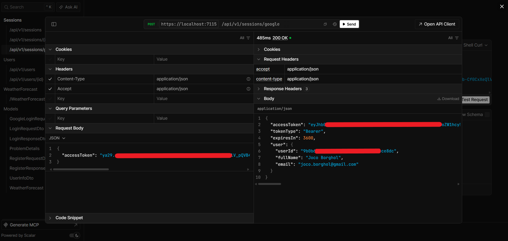
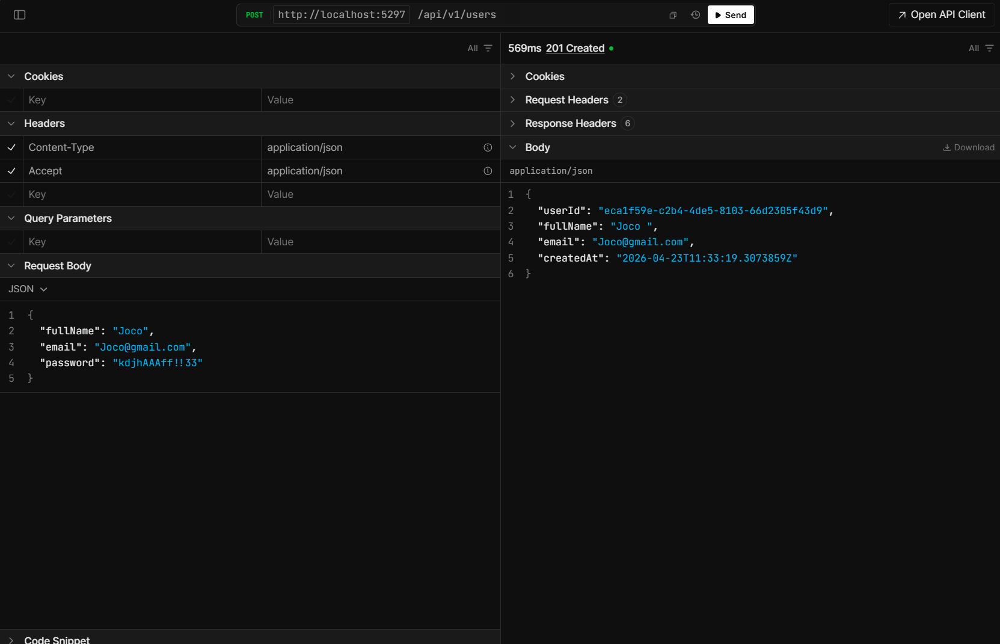
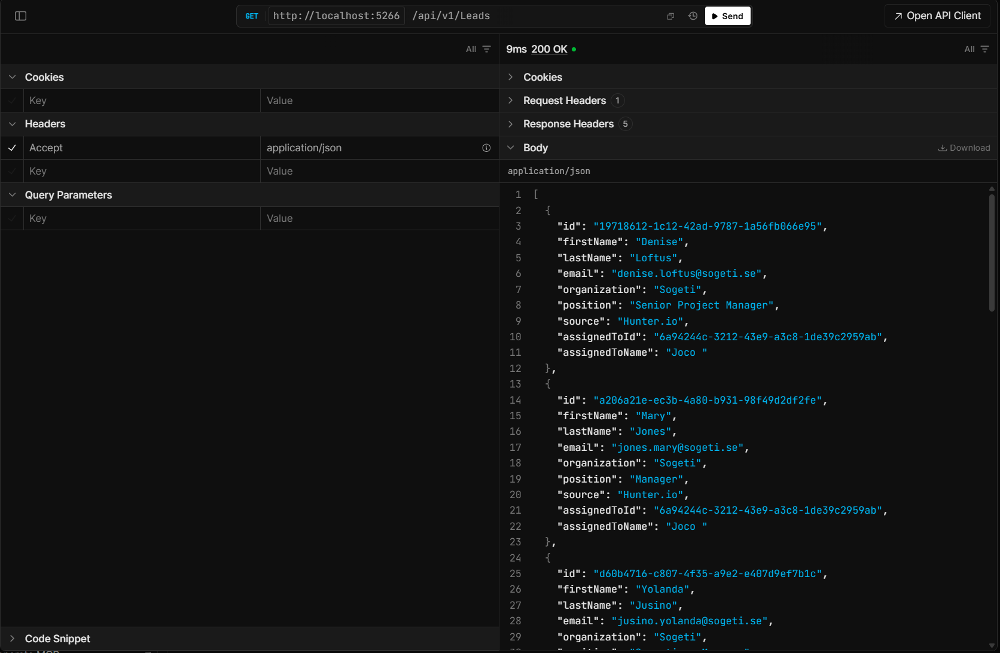
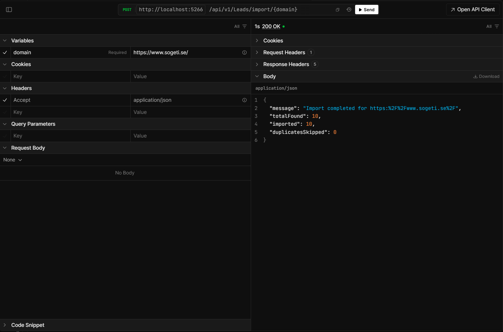
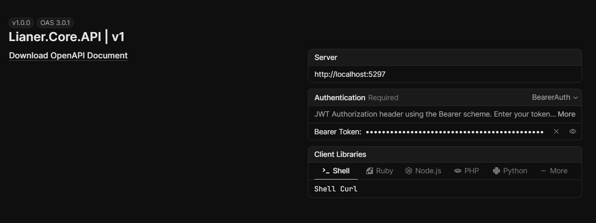
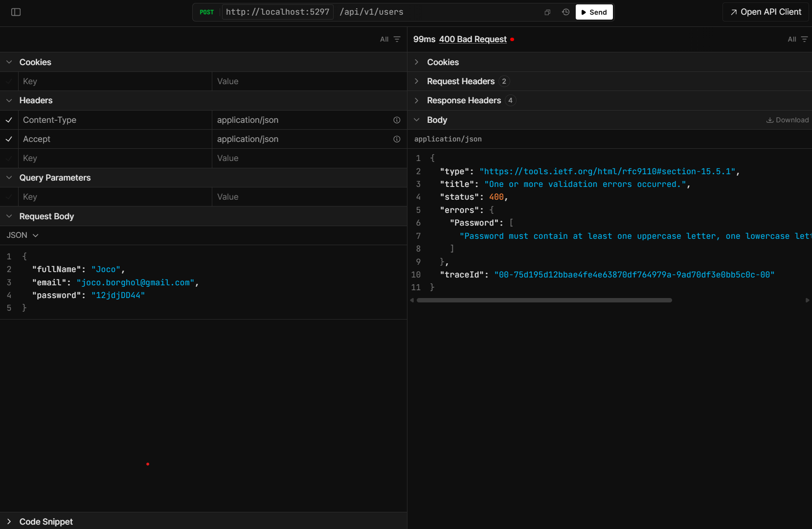
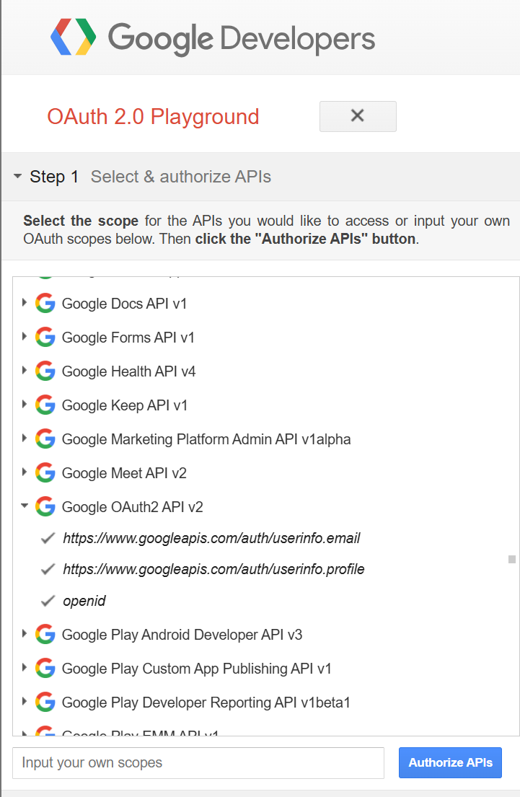
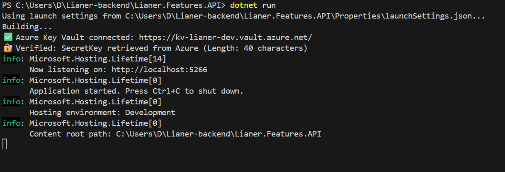

# Lianer Backend

A distributed ASP.NET Core 9 microservices solution featuring JWT authentication, Google OAuth2 integration, and external API communication. The backend API is ready for frontend integration.


---

## Table of Contents

- [Architecture](#architecture)
- [Features](#features)
- [Getting Started](#getting-started)
- [API Documentation](#api-documentation)
- [Security](#security)
- [Testing](#testing)
- [CI/CD](#cicd)
- [VG Implementation](#vg-implementation)
- [Team](#team)

---

## Architecture

### System Overview

The project consists of two separate ASP.NET Core Web API services communicating via HTTP:

```
                    ┌──────────────────────────────────────┐
                    │   FRONTEND (Planned)                 │
                    │   Not yet implemented                │
                    │   Testing via Scalar                 │
                    └────────────┬─────────────────────────┘
                                 │
                                 │ HTTPS (JWT Bearer)
                                 │
┌────────────────────────────────▼───────────────────────────────────────┐
│                                                                         │
│                        MICROSERVICES LAYER                              │
│                                                                         │
│  ┌─────────────────────────────┐      ┌──────────────────────────────┐  │
│  │  Lianer.Core.API            │      │  Lianer.Features.API         │  │
│  │  Port: 5297 (HTTP)          │◄────►│  Port: 5266 (HTTP)           │  │
│  │                             │ HTTP │                              │  │
│  │  - User Management          │      │  - Lead Management           │  │
│  │  - JWT Authentication       │      │  - Hunter.io Integration     │  │
│  │  - Google OAuth2 SSO        │      │  - Enriched Data from Core   │  │
│  │  - Session Management       │      │  - Bulk Contact Import       │  │
│  │  - Azure Key Vault          │      │  - Polly Resilience          │  │
│  │                             │      │                              │  │
│  └─────────────────────────────┘      └───────────────┬──────────────┘  │
│                                                       │                 │
└───────────────────────────────────────────────────────┼─────────────────┘
                                                        │
                                                        │ HTTPS (API Key)
                                                        │
                                        ┌───────────────▼────────────────┐
                                        │   Hunter.io API (External)     │
                                        │                                │
                                        │   - Domain Enrichment          │
                                        │   - Email Discovery            │
                                        │   - Company Information        │
                                        │                                │
                                        └────────────────────────────────┘

Communication:
- Frontend → Core API: HTTPS with JWT Bearer Token
- Core API ↔ Features API: HTTP with Typed HttpClient + Polly (Retry/Circuit Breaker)
- Features API → Hunter.io: HTTPS with API Key Authentication
```

### Services

**Status:** Both APIs are fully functional and tested via Scalar API documentation. Frontend integration is planned for future development.

#### Lianer.Core.API
Core functionality for user management and authentication.

**Endpoints:**
- `POST /api/v1/users` - Register new user
- `GET /api/v1/users` - List all users
- `GET /api/v1/users/{id}` - Get specific user
- `PUT /api/v1/users/{id}` - Update user profile (requires authentication)
- `DELETE /api/v1/users/{id}` - Delete user (own account only, requires authentication)
- `POST /api/v1/sessions` - Traditional login (email/password)
- `POST /api/v1/sessions/google` - Google OAuth2 login
- `GET /api/v1/sessions/google/url` - Get Google authorization URL

**Technologies:**
- ASP.NET Core 9.0
- Entity Framework Core (InMemory Database)
- JWT Bearer Authentication
- BCrypt.Net for password hashing
- Azure Key Vault for secrets
- Polly for resilience patterns

#### Lianer.Features.API
Business features and external API integration.

**Endpoints:**
- `GET /api/v1/leads` - List all leads (enriched with usernames)
- `GET /api/v1/leads/{id}/details` - Get lead details
- `GET /api/v1/leads/enrich/{domain}` - Enrich domain via Hunter.io
- `POST /api/v1/leads/import/{domain}` - Bulk import contacts from domain (requires authentication)
- `PATCH /api/v1/leads/{leadId}/assign` - Assign lead to user (requires authentication)
- `POST /api/v1/leads/prepare-test` - Prepare test data (requires authentication)

**Technologies:**
- ASP.NET Core 9.0
- Entity Framework Core (InMemory Database)
- Typed HttpClient for service-to-service communication
- Polly Standard Resilience Handler (Retry + Circuit Breaker)
- Hunter.io API integration

### Inter-service Communication

**CoreApiClient (Features API → Core API):**

```csharp
public class CoreApiClient
{
    // Fetch user information to enrich leads
    public async Task<CoreUserSummaryDto?> GetUserSummaryAsync(Guid userId)
    {
        var response = await _httpClient.GetAsync($"/api/v1/users/{userId}");
        if (response.StatusCode == HttpStatusCode.NotFound) return null;
        response.EnsureSuccessStatusCode();
        return await response.Content.ReadFromJsonAsync<CoreUserSummaryDto>();
    }
}
```

**Resilience Configuration:**
```csharp
builder.Services.AddHttpClient<CoreApiClient>(client =>
{
    client.BaseAddress = new Uri("http://localhost:5297/");
})
.AddResilienceHandler("core-api-pipeline", pipeline =>
{
    pipeline.AddRetry(new RetryStrategyOptions<HttpResponseMessage>
    {
        MaxRetryAttempts = 3,
        BackoffType = DelayBackoffType.Exponential,
        UseJitter = true,
        Delay = TimeSpan.FromSeconds(2)
    });

    pipeline.AddCircuitBreaker(new CircuitBreakerStrategyOptions<HttpResponseMessage>
    {
        FailureRatio = 0.5,
        SamplingDuration = TimeSpan.FromSeconds(30),
        BreakDuration = TimeSpan.FromSeconds(60)
    });
});
```


*Terminal output showing successful communication between Core API and Features API.*

---

## Features

### RESTful API Design
- Plural nouns for all URLs (`/api/v1/users`, `/api/v1/leads`)
- Correct HTTP methods (GET, POST, PUT, DELETE, PATCH)
- Standardized status codes (200, 201, 204, 400, 401, 403, 404, 500, 503)
- DTOs for separation between database models and API contracts
- URL versioning (`/api/v1/...`) via `Asp.Versioning.Http`

### Security
- JWT Bearer Authentication with HMAC-SHA256
- BCrypt hashing for passwords
- Google OAuth2 SSO with automatic user registration
- Strict CORS policy (no `AllowAnyOrigin`)
- Data Annotations for input validation (`[Required]`, `[EmailAddress]`, `[StringLength]`)
- Custom Action Filter for centralized model validation
- Ownership control (users can only delete their own accounts)

### Performance (Caching)
- In-Memory Cache (MemoryCache) for resource-intensive GET endpoints
- Cache invalidation (eviction) on data changes (POST, PUT, DELETE, PATCH)
- Exponential backoff with jitter for resilient requests
- Rate Limiting (Fixed Window: 100 requests/minute)
- Pagination on list endpoints (`?page=1&pageSize=20`)
- Advanced filtering via query parameters

### External API Integration
- Hunter.io Typed Client for domain enrichment
- Secure API Key authentication
- Error handling with `EnsureSuccessStatusCode()`
- Polly Standard Resilience Handler

### Testing
- Unit tests with xUnit and Moq
- Integration tests with `WebApplicationFactory`
- Correct DI architecture with `ValidateOnBuild` and `ValidateScopes`
- Avoids Service Locator anti-pattern

### API Documentation
- Scalar for modern API documentation
- XML comments on all endpoints
- OAuth2 security scheme in OpenAPI


*Scalar API documentation for bulk lead import.*

---

## Getting Started

### Prerequisites

- .NET 9.0 SDK or later
- Git
- A text editor (Visual Studio, VS Code, Rider)
- Google OAuth2 credentials (for SSO functionality)
- Hunter.io API key (for lead enrichment)

### Installation

#### 1. Clone the repository

```bash
git clone https://github.com/exikoz/Lianer-backend.git
cd Lianer-backend
```

#### 2. Configure User Secrets

**Core API:**
```bash
cd Lianer.Core.API

# JWT Settings (MANDATORY)
dotnet user-secrets set "JwtSettings:SecretKey" "MySecretKeyMustBeAtLeastThirtyTwoChars123!!"
dotnet user-secrets set "JwtSettings:Issuer" "LianerIssuer"
dotnet user-secrets set "JwtSettings:Audience" "LianerAudience"
dotnet user-secrets set "JwtSettings:ExpirationMinutes" "60"

# Google OAuth (MANDATORY for Google SSO)
dotnet user-secrets set "Google:Auth:ClientId" "YOUR_CLIENT_ID.apps.googleusercontent.com"
dotnet user-secrets set "Google:Auth:ClientSecret" "YOUR_CLIENT_SECRET"
dotnet user-secrets set "Google:Auth:RedirectUri" "http://localhost:3000/auth/callback"

# Verify
dotnet user-secrets list
```

**Features API:**
```bash
cd ../Lianer.Features.API

# Hunter.io API Key (MANDATORY for lead enrichment)
dotnet user-secrets set "Hunter:ApiKey" "YOUR_HUNTER_API_KEY"

# Verify
dotnet user-secrets list
```

**Important:** User Secrets are stored outside the project folder and are never checked into Git.

#### 3. Build the project

```bash
cd ..
dotnet build
```

#### 4. Run the services

**Option 1: Manually in separate terminals**

```bash
# Terminal 1: Core API
cd Lianer.Core.API
dotnet run --launch-profile https
# Listening on: https://localhost:5297

# Terminal 2: Features API
cd Lianer.Features.API
dotnet run --launch-profile https
# Listening on: https://localhost:5298
```

**Option 2: Visual Studio Multiple Startup Projects**

1. Right-click on the Solution in Solution Explorer
2. Select "Configure Startup Projects"
3. Choose "Multiple startup projects"
4. Set both `Lianer.Core.API` and `Lianer.Features.API` to "Start"
5. Press F5

### Ports

| Service | HTTP | HTTPS |
|---------|------|-------|
| Core API | 5297 | 7115 |
| Features API | 5266 | 7089 |

---

## API Documentation

Both services feature interactive API documentation via Scalar (Development mode only). Since the frontend is not yet implemented, Scalar is used to test and demonstrate all endpoints.

### Core API
**URL:** `https://localhost:5297/scalar/v1`

**Features:**
- Test all endpoints directly in the browser (replaces frontend during development)
- OAuth2 Authorization Code Flow for Google SSO
- Automatic JWT Bearer Token handling
- XML comments for all endpoints
- Complete API specification for future frontend integration


*Google OAuth2 endpoint testing in Scalar.*


*Successful registration of a new user in Core API.*

### Features API
**URL:** `https://localhost:5298/scalar/v1`

**Features:**
- Test lead enrichment and bulk import (replaces frontend during development)
- Display enriched leads with usernames from Core API
- Hunter.io domain search
- Complete API specification for future frontend integration


*Enriched lead list with usernames from Core API.*


*Successful import and enrichment of leads from Hunter.io in Features API.*

---

## Security

### Authentication

#### JWT Bearer Authentication

**Flow:**
1. User registers via `POST /api/v1/users`
2. User logs in via `POST /api/v1/sessions`
3. Backend returns a JWT token with a 60-minute lifespan
4. Client (Scalar/Postman/future frontend) sends the token in the `Authorization: Bearer {token}` header
5. Backend validates the token on protected endpoints


*Configuring BearerAuth (JWT) directly in Scalar for Core API.*


*Verification of password validation and error handling (401 Unauthorized).*

**Current Testing:** Use Scalar API documentation to test the authentication flow.

**Token Content:**
```json
{
  "sub": "user-guid",
  "name": "John Doe",
  "email": "john@example.com",
  "userId": "user-guid",
  "exp": 1714838400
}
```

**Protected Endpoints:**
- `PUT /api/v1/users/{id}` - Requires authentication
- `DELETE /api/v1/users/{id}` - Requires authentication + ownership
- `POST /api/v1/leads/import/{domain}` - Requires authentication (Features API)
- `PATCH /api/v1/leads/{leadId}/assign` - Requires authentication (Features API)

#### Google OAuth2 SSO

**Flow (Ready for frontend integration):**
1. Client fetches the authorization URL via `GET /api/v1/sessions/google/url`
2. Client redirects the user to Google
3. Google redirects back with an authorization code
4. Client exchanges the code for an access token (via Google)
5. Client sends the access token to `POST /api/v1/sessions/google`
6. Backend validates the token with Google
7. Backend creates or retrieves the user
8. Backend returns a JWT token

**Current Testing:** Use Scalar API documentation to test the Google SSO flow.


*Google OAuth2 authorization flow.*

**Auto-registration:**
- A Google user's first login automatically creates an account
- `Provider = "Google"` and `ExternalProviderId = {google-user-id}`
- No password is stored (`PasswordHash = null`)

### Input Validation

**Data Annotations on DTOs:**
```csharp
public class RegisterRequestDto
{
    [Required(ErrorMessage = "Full name is required")]
    [StringLength(100, MinimumLength = 2)]
    public string FullName { get; set; }

    [Required(ErrorMessage = "Email is required")]
    [EmailAddress(ErrorMessage = "Invalid email format")]
    public string Email { get; set; }

    [Required(ErrorMessage = "Password is required")]
    [StringLength(100, MinimumLength = 8)]
    public string Password { get; set; }
}
```

**Custom Action Filter:**
```csharp
public class ValidateModelFilter : IActionFilter
{
    public void OnActionExecuting(ActionExecutingContext context)
    {
        if (!context.ModelState.IsValid)
        {
            context.Result = new BadRequestObjectResult(context.ModelState);
        }
    }
}
```

### CORS Policy

**Strict Configuration:**
```csharp
builder.Services.AddCors(options =>
{
    options.AddPolicy("DefaultPolicy", policy =>
    {
        policy.WithOrigins(
                builder.Configuration.GetSection("Cors:AllowedOrigins").Get<string[]>()
                ?? ["http://localhost:5173", "http://localhost:3000"])
            .AllowAnyHeader()
            .AllowAnyMethod()
            .AllowCredentials();
    });
});
```

**Important:** Does NOT use `AllowAnyOrigin()` - only specified origins are allowed.

### Rate Limiting

**Fixed Window Limiter:**
```csharp
builder.Services.AddRateLimiter(options =>
{
    options.AddFixedWindowLimiter("fixed", limiterOptions =>
    {
        limiterOptions.PermitLimit = 100;
        limiterOptions.Window = TimeSpan.FromMinutes(1);
        limiterOptions.QueueLimit = 10;
    });
});

app.MapControllers().RequireRateLimiting("fixed");
```

**Result:** Maximum 100 requests per minute per client, thereafter `429 Too Many Requests`.

### Azure Key Vault

**Production:**
- All secrets are fetched from Azure Key Vault at startup
- DefaultAzureCredential for authentication (Managed Identity)
- VaultUri: `https://kv-lianer-dev.vault.azure.net/`


*Azure Key Vault secrets overview.*

**Development:**
- User Secrets for local development
- Fallback mechanism only for tests

---

## Testing

### Unit Tests

**Example: AuthService test with Moq**
```csharp
[Fact]
public async Task RegisterAsync_ShouldHashPassword_AndCreateUser()
{
    // Arrange
    var mockContext = new Mock<AppDbContext>();
    var mockLogger = new Mock<ILogger<AuthService>>();
    var mockTokenService = new Mock<ITokenService>();
    
    var service = new AuthService(mockContext.Object, mockLogger.Object, mockTokenService.Object);
    
    var request = new RegisterRequestDto
    {
        FullName = "John Doe",
        Email = "john@example.com",
        Password = "SecurePassword123!"
    };

    // Act
    var result = await service.RegisterAsync(request);

    // Assert
    Assert.NotNull(result);
    Assert.Equal("john@example.com", result.Email);
    mockContext.Verify(x => x.SaveChangesAsync(default), Times.Once);
}
```

### Integration Tests

**Example: WebApplicationFactory test**
```csharp
public class UsersControllerTests : IClassFixture<CustomWebApplicationFactory>
{
    private readonly HttpClient _client;

    public UsersControllerTests(CustomWebApplicationFactory factory)
    {
        _client = factory.CreateClient();
    }

    [Fact]
    public async Task CreateUser_ShouldReturn201Created()
    {
        // Arrange
        var request = new RegisterRequestDto
        {
            FullName = "Test User",
            Email = "test@example.com",
            Password = "TestPassword123!"
        };

        // Act
        var response = await _client.PostAsJsonAsync("/api/v1/users", request);

        // Assert
        Assert.Equal(HttpStatusCode.Created, response.StatusCode);
    }
}
```

### Running Tests

```bash
# All tests
dotnet test

# Only unit tests
dotnet test --filter Category=Unit

# Only integration tests
dotnet test --filter Category=Integration

# With code coverage
dotnet test /p:CollectCoverage=true
```

### Dependency Injection Validation

**Prevents common DI issues:**
```csharp
builder.Host.UseDefaultServiceProvider(options =>
{
    options.ValidateScopes = true;      // Prevents Captive Dependencies
    options.ValidateOnBuild = true;     // Prevents missing registrations
});
```

---

## CI/CD

### GitHub Actions

**Pipeline:** `.github/workflows/ci.yml`

**Steps:**
1. Checkout code
2. Setup .NET 9.0
3. Restore dependencies
4. Build solution
5. Run all tests
6. Publish test results

**Triggers:**
- Push to `main` or `dev`
- Pull requests against `main`

**Badge:**


### Branch Strategy

- `main` - Production code (protected, requires PR + review)
- `dev` - Development branch
- `feature/*` - Feature branches
- `bugfix/*` - Bugfix branches

**Pull Request Process:**
1. Create feature branch from `dev`
2. Implement functionality
3. Create PR against `dev`
4. Minimum one team member review
5. CI/CD pipeline must be green
6. Merge after approval

---

## VG Implementation

### 1. Custom Exception Middleware

**Robust error handling with RFC 7807 ProblemDetails:**

```csharp
public class ExceptionMiddleware
{
    private readonly RequestDelegate _next;
    private readonly ILogger<ExceptionMiddleware> _logger;

    public ExceptionMiddleware(RequestDelegate next, ILogger<ExceptionMiddleware> logger)
    {
        _next = next;
        _logger = logger;
    }

    public async Task InvokeAsync(HttpContext context)
    {
        try
        {
            await _next(context);
        }
        catch (Exception ex)
        {
            _logger.LogError(ex, "Unhandled exception occurred: {Message}", ex.Message);
            await HandleExceptionAsync(context, ex);
        }
    }

    private static Task HandleExceptionAsync(HttpContext context, Exception exception)
    {
        var (statusCode, title) = exception switch
        {
            ArgumentException => (HttpStatusCode.BadRequest, "Bad Request"),
            KeyNotFoundException => (HttpStatusCode.NotFound, "Not Found"),
            NotFoundException => (HttpStatusCode.NotFound, "Not Found"),
            UnauthorizedAccessException => (HttpStatusCode.Unauthorized, "Unauthorized"),
            InvalidOperationException => (HttpStatusCode.Conflict, "Conflict"),
            _ => (HttpStatusCode.InternalServerError, "Internal Server Error")
        };

        context.Response.ContentType = "application/problem+json";
        context.Response.StatusCode = (int)statusCode;

        return context.Response.WriteAsJsonAsync(new { Title = title, Status = (int)statusCode });
    }
}
```

### 2. Resilience Patterns with Polly

**Retry Policy for Google API:**
```csharp
var retryPolicy = Policy
    .Handle<HttpRequestException>()
    .WaitAndRetryAsync(
        retryCount: 3,
        sleepDurationProvider: retryAttempt => TimeSpan.FromSeconds(Math.Pow(2, retryAttempt)),
        onRetry: (outcome, timespan, retryCount, context) =>
        {
            _logger.LogWarning("Retrying Google API call. Attempt: {Attempt}", retryCount);
        });

var result = await retryPolicy.ExecuteAsync(async () =>
{
    var response = await _httpClient.SendAsync(request);
    response.EnsureSuccessStatusCode();
    return await response.Content.ReadFromJsonAsync<GoogleUserInfoDto>();
});
```

**Circuit Breaker for Core API:**
```csharp
pipeline.AddCircuitBreaker(new CircuitBreakerStrategyOptions<HttpResponseMessage>
{
    FailureRatio = 0.5,                          // Open at 50% failure
    SamplingDuration = TimeSpan.FromSeconds(30), // Measure over 30 seconds
    MinimumThroughput = 2,                       // Minimum 2 requests
    BreakDuration = TimeSpan.FromSeconds(60),    // Open for 60 seconds
    OnOpened = args =>
    {
        Console.WriteLine("[Circuit Breaker] Opened. Core API is likely down.");
        return default;
    }
});
```

### 4. Caching on GET Endpoints (In-Memory Cache)

**Implemented in both Core and Features APIs:**

```csharp
// Example from LeadsController
if (cache.TryGetValue(LeadsCacheKey, out object? cachedLeads))
{
    return Ok(cachedLeads);
}

// ... fetch and enrich data ...

cache.Set(LeadsCacheKey, enrichedLeads, new MemoryCacheEntryOptions
{
    AbsoluteExpirationRelativeToNow = TimeSpan.FromMinutes(5)
});
```

**Automatic Invalidation:**
The cache is cleared immediately upon calls to endpoints that change underlying data (e.g., `BulkImport` or `AssignLead`), ensuring the user always sees consistent information.

### 3. Multiple External API Integrations

**Hunter.io (API Key):**
```csharp
builder.Services.AddHttpClient<HunterClient>(client =>
{
    client.BaseAddress = new Uri("https://api.hunter.io/");
})
.AddStandardResilienceHandler();
```

**Google OAuth2 (Bearer Token):**
```csharp
builder.Services.AddHttpClient("GoogleAuth", client =>
{
    client.BaseAddress = new Uri("https://www.googleapis.com/");
    client.Timeout = TimeSpan.FromSeconds(30);
});
```

---

## Surgical Test Flow (End-to-End)

Follow these steps to verify the entire system's functionality (Security, Integration & Caching).

### Phase 1: Core API (Port 5297)
*Open Scalar: http://localhost:5297/scalar/v1*

1.  **Create User**
    *   **Endpoint**: `POST /api/v1/users`
    *   **Body**:
        ```json
        {
          "fullName": "Test Testsson",
          "email": "test@test.se",
          "password": "Password123!"
        }
        ```
    *   **Goal**: Copy the `userId` from the response.

2.  **Login**
    *   **Endpoint**: `POST /api/v1/sessions`
    *   **Body**: Same credentials as above.
    *   **Goal**: Copy the entire `accessToken` field.

3.  **Authorize**
    *   Click **Authorize** in Scalar (**BearerAuth is now selected by default**).
    *   Paste your token into the **Token** field.

---

### Phase 2: Features API (Port 5266)
*Switch tab to Scalar: http://localhost:5266/scalar/v1*

4.  **Authorize**
    *   Click **Authorize** and paste the **same** token you received from Core API.

5.  **Import Leads (Protected 🔒)**
    *   **Endpoint**: `POST /api/v1/leads/import/microsoft.com`
    *   **Goal**: Verify you receive `200 OK` and leads are imported from Hunter.io.

6.  **Fetch Lead ID**
    *   **Endpoint**: `GET /api/v1/leads` (Open)
    *   **Goal**: Copy an `id` from the list.

7.  **Assign Lead (Protected 🔒)**
    *   **Endpoint**: `PATCH /api/v1/leads/{leadId}/assign`
    *   **Body**:
        ```json
        {
          "userId": "YOUR_USER_ID_FROM_STEP_1"
        }
        ```
    *   **Goal**: Verify the lead is now linked to your user.

---

### Phase 3: Verification

8.  **Integration & Enrichment**
    *   **Endpoint**: `GET /api/v1/leads/{leadId}/details`
    *   **Result**: You should now see `"assignedToName": "Test Testsson"`. Features API has fetched the name live from Core API.

9.  **Caching**
    *   Call `GET /api/v1/leads` multiple times.
    *   **Result**: Check the Features API terminal. You should see the log: `info: Returning leads from cache.`

10. **Invalidation**
    *   Change your name in Core API (`PUT /api/v1/users/{userId}`).
    *   Go back to Features API and fetch leads again.
    *   **Result**: The cache should have been cleared automatically, and the new name should appear immediately.

---

## Team

**API Architects - .NET Team Malmö**

- [Joco Borghol](https://github.com/JocoBorghol) - Backend Developer
- [Alexander Jansson](https://github.com/alexanderjson) - Backend Developer
- [Hussein Hasnawy](https://github.com/exikoz) - Backend Developer

---

## Contact

For questions or feedback, contact the team via GitHub Issues or create a Pull Request.

**Repository:** [https://github.com/exikoz/Lianer-backend](https://github.com/exikoz/Lianer-backend)

---

## Technical Verification (Logs)

Here are actual logs from the system verifying that critical functions are active:

### 1. Caching & Invalidering (Features API)
Logs showing the system detecting missing cache data, fetching it, and returning it from memory on subsequent calls.
```text
info: GET /api/v1/leads called (Cache Check)
info: Cache miss. Fetching fresh data and enriching.
info: Saved 10 entities to in-memory store.
...
info: GET /api/v1/leads called (Cache Check)
info: Returning leads from cache.
```

### 2. Resilience with Polly (CoreApiClient)
Verification of Polly monitoring the inter-service call and confirming success within policy.
```text
info: Polly[3]
      Execution attempt. Source: 'CoreApiClient-core-api-pipeline//Retry', 
      Operation Key: '', Result: '200', Attempt: '0', Execution Time: 19.3348ms
```

### 3. Security & Error Handling (Core API)
Logs demonstrating a correctly handled security incident (invalid password) followed by successful login and JWT generation.
```text
warn: Login failed: Invalid password for email test@test.se
fail: Unhandled exception caught by middleware. Status: 401, Path: /api/v1/sessions
...
info: User authenticated successfully: 17c98dcb-9e66-4d3b-9eea-2508d7270839
info: JWT token generated for user: 17c98dcb-9e66-4d3b-9eea-2508d7270839
```

---
