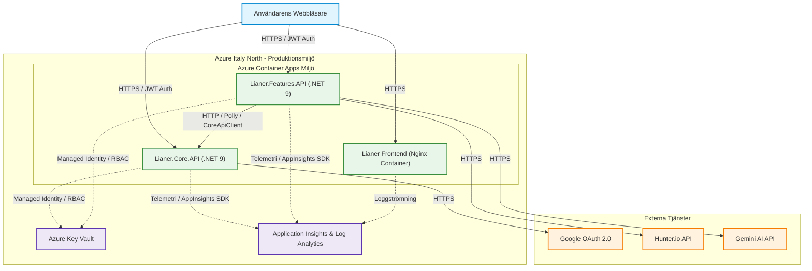
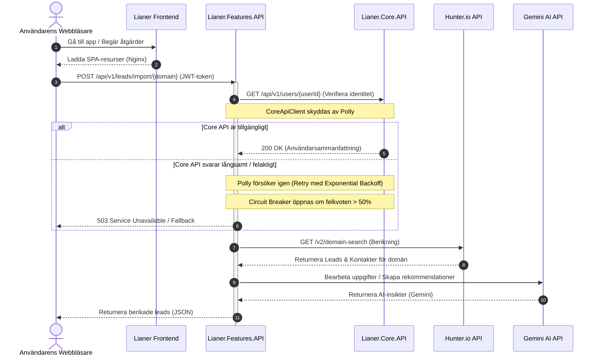

# Lianer Backend 2.0 (Svenska)

[English](README.md) | [Swedish](README.sv.md) | [Dokumentation](deployment.md) | [ADR](docs/adr/0001-choosing-azure-hosting.md) | [AI](README.sv.md#ai-driven-funktion-gemini-ai-integration) | [Frontend Live-demo](https://lianer-frontend.icybush-5ce7e353.italynorth.azurecontainerapps.io)

En säker och distribuerad ASP.NET Core 9-mikrotjänstarkitektur byggd för molndriftsättning. Innehåller JWT-autentisering, Google OAuth2-integration, extern API-kommunikation (Hunter.io & Gemini AI) och lösenordsfri Azure Key Vault-integration.

**Live-applikation:** [Lianer Frontend App](https://lianer-frontend.icybush-5ce7e353.italynorth.azurecontainerapps.io)


---

## Innehållsförteckning

- [Driftsättning och Systemstatus](#driftsättning-och-systemstatus)
- [Arkitektur](#arkitektur)
- [Funktioner](#funktioner)
- [Kom igång](#kom-igång)
- [API-dokumentation](#api-dokumentation)
- [Säkerhet](#säkerhet)
- [Testning](#testning)
- [CI/CD-pipeline](#cicd-pipeline)
- [Avancerade design- och stabilitetsmönster](#avancerade-design-och-stabilitetsmönster)
- [Team](#team)

---

## Driftsättning och Systemstatus

Systemet är fullständigt containeriserat och driftsatt i en enhetlig miljö i molnet. Nedan följer en utförlig genomgång av hur systemets olika delar har byggts, säkrats, kvalitetssäkrats och satts i drift. Klicka på respektive sektion för att expandera och läsa mer:

<details>
<summary><b>Containerisering & Azure-hosting (fullstack)</b></summary>

För att garantera en reproducerbar och konsekvent driftmiljö har vi containeriserat hela vår applikationsstack. 

#### Backend-mikrotjänster (Lianer.Core.API & Lianer.Features.API)
Containrarna hanteras via multi-stage Dockerfiles. För att uppnå högsta möjliga säkerhetsstandard (säkerhetsdjup/Defense in Depth) har vi gjort följande designval:
- **Chiseled- och Rootless-avbilder:** Vi använder minimala `mcr.microsoft.com/dotnet/aspnet:9.0-noble-chiseled` som runtime-avbild. Denna innehåller inget operativsystemsskal (inget `Microsoft.AspNetCore.Http` eller `bash`), ingen pakethanterare och inga extra verktyg. Detta minimerar containerns attackyta dramatiskt då en angripare inte kan köra egna kommandon eller skript.
- **Icke-root-användare (USER app):** Applikationerna körs under den inbyggda icke-privilegierade användaren `app` (UID 1654). Eftersom icke-root-användare inte får lyssna på portar under 1024 är apparna konfigurerade att lyssna på port **8080**. Detta förhindrar att en angripare kan få administratörsrättigheter (root-åtkomst) till underliggande system om appen skulle bli hackad.

#### Frontend-container (Nginx)
Frontenden (Vanilla JS SPA) har containeriserats i en obehörig (rootless) Nginx-avbild (`nginxinc/nginx-unprivileged:alpine`) som lyssnar på port 8080. 
- **Arkitekturbeslut (ADR):** Ursprungligen planerades Azure Static Web Apps (SWA). Dock stöder Azure for Students-konton endast 5 specifika regioner, och SWA är inte tillgängligt i någon av dem i vår prenumeration (Policy Error: `RequestDisallowedByAzure`). Lösningen blev att styra om till en containeriserad frontend i Azure Container Apps (ACA), vilket gav fördelen att samla hela applikationsstacken i samma enhetliga ACA-miljö. Se [ADR 0001: Val av driftsättnings- och hostingplattform](docs/adr/0001-choosing-azure-hosting.md).

*   **För fullständiga designdetaljer, se:** [1. Containerisering av backend-mikrotjänster (Task 1)](deployment.md#1-containerisering-av-backend-mikrotjänster-task-1) samt [2. Containerisering & Molnvärdskap för Frontend (ADR)](deployment.md#2-containerisering--molnvärdskap-för-frontend-adr).

<details>
<summary><b>Visa skärmbilder</b></summary>


*Driftsstatus för Azure Container Apps.*


*Miljövariabelkonfiguration i Container Apps.*
</details>
</details>

<details>
<summary><b>Säker konfiguration & Key Vault</b></summary>

Vi har eliminerat risken för läckta produktionsnycklar och anslutningssträngar genom att helt rensa källkod och konfigurationsfiler från hemligheter.

#### Azure Key Vault-arkitektur
- **Centraliserad lagring:** Alla hemligheter (JWT-nycklar, Google OAuth-hemligheter och externa API-nycklar) lagras centralt i Azure Key Vault.
- **Infrastruktur som kod (Bicep):** Hela infrastrukturen för Key Vault är uppsatt med kod i `infra/keyvault.bicep` och driftsätts automatiskt via CI/CD.

#### Lösenordsfri autentisering (Managed Identity & RBAC)
- **Lösenordsfri åtkomst:** Tjänsterna i Azure Container Apps använder en inbyggd identitet (**Managed Identity**) för att kommunicera med Key Vault. 
- **Minsta behörighet (RBAC):** Istället för de äldre, krångliga behörighetsreglerna använder vi rollbaserad åtkomst (RBAC) via Bicep-kod (`infra/roleAssignments.bicep`). Tjänsterna tilldelas rollen *Key Vault Secrets User*, vilket ger dem *enbart* läsrättigheter till hemligheterna under körning.
- **Säker lokal reservlösning (fallback):** I `Program.cs` finns en try-catch-logik som anropar `DefaultAzureCredential()`. Om appen inte kan ansluta till Azure vid uppstart (t.ex. vid lokal offline-utveckling) faller den automatiskt tillbaka på lokala User Secrets, vilket gör att utvecklingsteamet kan samarbeta smidigt oavsett Azure-behörigheter.

*   **För fullständiga säkerhetsdetaljer, se:** [4. Säkerhet & Key Vault (Epic 4)](deployment.md#4-säkerhet--key-vault-epic-4).

<details>
<summary><b>Visa skärmbilder</b></summary>


*RBAC-rolltilldelningar i Key Vault.*


*Lista över aktiva hemligheter i Azure Key Vault.*
</details>
</details>

<details>
<summary><b>CI/CD (build, test, release)</b></summary>

För att garantera systemets stabilitet och spårbarhet styrs alla releaser av GitHub Actions-pipelines:

#### Quality Gates (pr.yml)
Varje Pull Request mot `main` eller `dev` valideras automatiskt:
- Kör `npm ci`, linting och Jest-tester för frontenden.
- Kör `dotnet restore`, `build` och tester för backenden.
- Utför en provbyggning (`docker build`) av samtliga Dockerfiler för att säkerställa att containerinfrastrukturen är intakt innan koden tillåts mergas.

#### Continuous Deployment (deploy.yml)
När kod slås samman till `main` driftsätts den automatiskt:
- Loggar in säkert mot Azure och Azure Container Registry (ACR) via lösenordsfri OpenID Connect (OIDC) Federated Credentials.
- Bygger produktionsavbilderna och taggar dem med det unika **GitHub Commit SHA** (istället för bara `latest`). Detta ger absolut spårbarhet från den körande koden i produktion direkt till den specifika kodraden i Git.
- Uppdaterar Container Apps-miljön (`az containerapp update`) i regionen Italy North.

*   **För fullständiga pipeline-detaljer, se:** [3. CI/CD Pipeline (Epic 3)](deployment.md#3-cicd-pipeline-epic-3).
</details>

<details>
<summary><b>Övervakning & felsökbarhet</b></summary>

Vi har etablerat en komplett övervakningslösning i vår produktionsekosystem för att snabbt kunna isolera och felsöka incidenter.

#### Monitorering med Application Insights
- **Automatisk spårning:** Loggar inkommande HTTP-anrop, svarstider, statuskoder, ohanterade fel (via vår anpassade `ExceptionMiddleware`) samt utgående anrop via `HttpClient`.
- **Distribuerad spårning (Application Map):** Azure ritar automatiskt upp kommunikationskedjan (Frontend ➔ Features API ➔ Core API ➔ Hunter.io). Om en länk i kedjan går långsamt eller fallerar syns det direkt på kartan.

#### Operations Runbook & KQL
I händelse av driftstörningar felsöker vi systemet enligt följande runbook-steg:
1. **Realtidsloggar (Log Stream):** Visa loggar i realtid direkt i Azure Portal eller via CLI:
   ```bash
   az containerapp logs show --name lianer-core-api --resource-group rg-lianer-prod --follow
   ```
2. **Realtidstelemetri (Live Metrics):** Följ CPU, minne, anropsfrekvens och loggströmmar live i Application Insights.
3. **Logganalys via KQL (Kusto Query Language):** Kör frågor i Log Analytics för att hitta mönster. Exempel på frågor som ingår i dokumentationen:
   * Genomsnittlig svarstid per endpoint (Prestanda-analys)
   * Trafik-trend (Anrop per timme de senaste 24 timmarna)
   * Fel och misslyckade externa anrop (Beroende-analys)

*   **För fullständiga runbook-steg och skärmbilder, se:** [5. Övervakning & Felsökbarhet (Epic 5)](deployment.md#5-övervakning--felsökbarhet-epic-5).

<details>
<summary><b>Visa skärmbilder</b></summary>


*Distribuerad spårning och programkarta i Application Insights.*


*Live-telemetriström i Application Insights.*


*KQL-frågeresultat för genomsnittlig svarstid per endpoint.*


*KQL-frågeresultat för anropstrend.*


*KQL-frågeresultat för misslyckade externa beroendeanrop.*
</details>
---

## Arkitektur


### Systemarkitektur (System Architecture Map)

Följande diagram illustrerar molninfrastrukturen och anropsflödet för Lianers fullstack-applikation i Azure:



### Anrops- och Stabilitetsflöde (Sekvensdiagram)

Nedan visas sekvensflödet som demonstrerar hur anrop rör sig genom systemet, skyddade av Polly-stabilitetsmekanismer och berikade med Gemini AI-funktioner:



<details>
<summary><b>Detaljer om tjänster & kommunikation</b></summary>

### Tjänsteöversikt (Services Overview)

Systemet är uppdelat i tre huvudkomponenter:
1. **Lianer Frontend:** En Vanilla JavaScript single-page application (SPA) paketerad i en säker, rootless Nginx-container (`nginxinc/nginx-unprivileged:alpine`) som körs på port 8080.
2. **Lianer.Core.API:** Kärntjänst som hanterar användaradministration, sessionshantering (JWT/Google SSO) samt lokala databasoperationer.
3. **Lianer.Features.API:** Affärsfunktionstjänst som utför lead-berikning via Hunter.io, bulk-import av leads och uppgiftshantering.

#### Lianer.Core.API Endpoints:

**Användar- & Sessionshantering:**
- `POST /api/v1/users` - Registrera ny användare
- `GET /api/v1/users` - Visa alla användare (cachelagrad)
- `GET /api/v1/users/{id}` - Hämta specifik användare (cachelagrad)
- `PUT /api/v1/users/{id}` - Uppdatera användarprofil (kräver autentisering)
- `DELETE /api/v1/users/{id}` - Ta bort användare (endast eget konto, kräver autentisering)
- `POST /api/v1/sessions` - Traditionell inloggning (e-post/lösenord)
- `POST /api/v1/sessions/google` - Google OAuth2-inloggning
- `GET /api/v1/sessions/google/url` - Hämta Google auktoriserings-URL

**Kontakthantering (kräver autentisering):**
- `GET /api/v1/contacts/{id}` - Hämta kontakt via ID
- `POST /api/v1/contacts` - Skapa ny kontakt
- `PUT /api/v1/contacts/{id}` - Uppdatera befintlig kontakt
- `DELETE /api/v1/contacts/{id}` - Ta bort kontakt

**Aktivitetshantering (kräver autentisering):**
- `GET /api/v1/activities` - Lista alla aktiviteter (paginerad)
- `GET /api/v1/activities/{id}` - Hämta specifik aktivitet via ID
- `GET /api/v1/activities/user/{id}` - Hämta aktiviteter för en specifik användare
- `POST /api/v1/activities` - Skapa ny aktivitet
- `PUT /api/v1/activities` - Uppdatera befintlig aktivitet
- `DELETE /api/v1/activities/{id}` - Ta bort aktivitet

**Aktivitetsanteckningar (kräver autentisering):**
- `GET /api/v1/activities/{activityId}/notes` - Lista anteckningar för en aktivitet (paginerad)
- `GET /api/v1/activities/{activityId}/notes/{noteId}` - Hämta specifik anteckning
- `POST /api/v1/activities/{activityId}/notes` - Skapa anteckning för en aktivitet
- `PUT /api/v1/activities/{activityId}/notes/{noteId}` - Uppdatera anteckning
- `DELETE /api/v1/activities/{activityId}/notes/{noteId}` - Ta bort anteckning

#### Lianer.Features.API Endpoints:
- `GET /api/v1/leads` - Lista alla leads (berikade med användarnamn)
- `GET /api/v1/leads/{id}/details` - Hämta lead-detaljer
- `GET /api/v1/leads/enrich/{domain}` - Berika domän via Hunter.io
- `POST /api/v1/leads/import/{domain}` - Bulk-importa kontakter från en domän (kräver autentisering)
- `PATCH /api/v1/leads/{leadId}/assign` - Tilldela lead till användare (kräver autentisering)
- `POST /api/v1/leads/prepare-test` - Förbered testdata (kräver autentisering)

### Kommunikation mellan tjänster (Inter-service Communication)

**CoreApiClient (Features API → Core API):**
```csharp
public class CoreApiClient
{
    // Hämtar användarinformation för att berika leads
    public async Task<CoreUserSummaryDto?> GetUserSummaryAsync(Guid userId)
    {
        var response = await _httpClient.GetAsync($"/api/v1/users/{userId}");
        if (response.StatusCode == HttpStatusCode.NotFound) return null;
        response.EnsureSuccessStatusCode();
        return await response.Content.ReadFromJsonAsync<CoreUserSummaryDto>();
    }
}
```

**Konfiguration av motståndskraft (Resilience Configuration):**
```csharp
builder.Services.AddHttpClient<CoreApiClient>(client =>
{
    client.BaseAddress = new Uri("http://localhost:5297/");
})
.AddResilienceHandler("core-api-pipeline", pipeline =>
{
    pipeline.AddRetry(new RetryStrategyOptions<HttpResponseMessage>
    {
        MaxRetryAttempts = 3,
        BackoffType = DelayBackoffType.Exponential,
        UseJitter = true,
        Delay = TimeSpan.FromSeconds(2)
    });

    pipeline.AddCircuitBreaker(new CircuitBreakerStrategyOptions<HttpResponseMessage>
    {
        FailureRatio = 0.5,
        SamplingDuration = TimeSpan.FromSeconds(30),
        BreakDuration = TimeSpan.FromSeconds(60)
    });
});
```

<details>
<summary><b>Visa skärmbild</b></summary>


*Terminalutskrift som visar lyckad kommunikation mellan Core API och Features API.*
</details>
</details>

---

## Funktioner

<details>
<summary><b>Teknisk funktionslista</b></summary>


### RESTful API-design
- Plurala substantiv för alla webbadresser (`/api/v1/users`, `/api/v1/leads`)
- Korrekta HTTP-metoder (GET, POST, PUT, DELETE, PATCH)
- Standardiserade statuskoder (200, 201, 204, 400, 401, 403, 404, 500, 503)
- DTO:er för separation mellan databasmodeller och API-kontrakt
- URL-versionering (`/api/v1/...`) via `Asp.Versioning.Http`

### Säkerhet
- JWT Bearer-autentisering med HMAC-SHA256
- BCrypt-hashing för lösenord
- Google OAuth2 SSO med automatisk användarregistrering
- Strikt CORS-policy (ingen `AllowAnyOrigin`)
- Data Annotations för indatavalidering (`[Required]`, `[EmailAddress]`, `[StringLength]`)
- Eget Action Filter för centraliserad modellvalidering
- Ägandekontroll (användare kan endast ta bort sina egna konton)

### Prestanda (Cachelagring)
- In-Memory Cache (MemoryCache) för resurskrävande GET-endpoints
- Cache-invalidering (rensning) vid dataändringar (POST, PUT, DELETE, PATCH)
- Exponentiell backoff med jitter för tåliga anrop
- Rate Limiting (Fixed Window: 100 anrop/minut)
- Paginering på list-endpoints (`?page=1&pageSize=20`)
- Avancerad filtrering via query-parametrar

### Extern API-integration
- **Hunter.io API**: Integreras via en typsäker HttpClient med Polly-felhantering för att söka på domäner och berika leads i Features API.
- **Google OAuth 2.0 API**: Används i Core API för att verifiera och logga in användare via Google Single Sign-On (SSO).
- **Google Gemini AI API**: Integreras i Features API för att köra AI-baserad uppgiftskategorisering, lead-insikter och rekommendationer.
- Säker hantering av API-nycklar och klienthemligheter via Azure Key Vault (produktion) och User Secrets (lokal utveckling).
- Integrerad felhantering via `EnsureSuccessStatusCode()` och anpassad Exception Middleware.
- Inbyggd motståndskraft (API resiliency) med Pollys standardiserade felhanteringsinfrastruktur (retries, backoff med jitter, circuit breaker).

### Testning
- Enhetstester med xUnit och Moq
- Integrationstester med `WebApplicationFactory`
- Korrekt DI-arkitektur med `ValidateOnBuild` och `ValidateScopes`
- Undviker Service Locator-antimönstret

### API-dokumentation
- Scalar för modern API-dokumentation
- XML-kommentarer på alla endpoints
- OAuth2-säkerhetsschema i OpenAPI

<details>
<summary><b>Visa skärmbild</b></summary>


*Scalar API-dokumentation för bulk-import av leads.*
</details>
</details>

---

## Kom igång

<details>
<summary><b>Inställningar, installation & körningsguide</b></summary>


### Förutsättningar

- .NET 9.0 SDK eller senare
- Git
- En textredigerare (Visual Studio, VS Code, Rider)
- Google OAuth2-credentials (för SSO-funktionalitet)
- Hunter.io API-nyckel (för lead-berikning)

### Installation

#### 1. Klona arkivet

```bash
git clone https://github.com/exikoz/Lianer-backend.git
cd Lianer-backend
```

#### 2. Konfigurera User Secrets

**Core API:**
```bash
cd Lianer.Core.API

# JWT-inställningar (OBLIGATORISKT)
dotnet user-secrets set "JwtSettings:SecretKey" "MySecretKeyMustBeAtLeastThirtyTwoChars123!!"
dotnet user-secrets set "JwtSettings:Issuer" "LianerIssuer"
dotnet user-secrets set "JwtSettings:Audience" "LianerAudience"
dotnet user-secrets set "JwtSettings:ExpirationMinutes" "60"

# Google OAuth (OBLIGATORISKT för Google SSO)
dotnet user-secrets set "Google:Auth:ClientId" "YOUR_CLIENT_ID.apps.googleusercontent.com"
dotnet user-secrets set "Google:Auth:ClientSecret" "YOUR_CLIENT_SECRET"
dotnet user-secrets set "Google:Auth:RedirectUri" "http://localhost:3000/auth/callback"

# Verifiera
dotnet user-secrets list
```

**Features API:**
```bash
cd ../Lianer.Features.API

# Hunter.io API-nyckel (OBLIGATORISKT för lead-berikning)
dotnet user-secrets set "Hunter:ApiKey" "YOUR_HUNTER_API_KEY"

# Verifiera
dotnet user-secrets list
```

**Viktigt:** User Secrets lagras utanför projektmappen och checkas aldrig in i Git.

#### 3. Bygg projektet

```bash
cd ..
dotnet build
```

#### 4. Kör tjänsterna

**Alternativ 1: Manuellt i separata terminaler**

```bash
# Terminal 1: Core API
cd Lianer.Core.API
dotnet run --launch-profile https
# Lyssnar på: https://localhost:5297

# Terminal 2: Features API
cd Lianer.Features.API
dotnet run --launch-profile https
# Lyssnar på: https://localhost:5298
```

**Alternativ 2: Visual Studio Multiple Startup Projects**

1. Högerklicka på lösningen (Solution) i Solution Explorer
2. Välj "Configure Startup Projects"
3. Välj "Multiple startup projects"
4. Sätt både `Lianer.Core.API` och `Lianer.Features.API` till "Start"
5. Tryck på F5

### Portar

| Tjänst | HTTP | HTTPS |
|---------|------|-------|
| Core API | 5297 | 7115 |
| Features API | 5266 | 7089 |
</details>

---

## API-dokumentation

<details>
<summary><b>Scalar API-detaljer & verifiering</b></summary>


Båda tjänsterna har interaktiv API-dokumentation via Scalar (endast i utvecklingsläge). Eftersom frontenden inte är helt integrerad används Scalar för att testa och demonstrera alla endpoints.

### Core API
**URL:** `https://localhost:5297/scalar/v1`

**Funktioner:**
- Testa alla endpoints direkt i webbläsaren (ersätter frontend under utveckling)
- OAuth2 Authorization Code Flow för Google SSO
- Automatisk hantering av JWT Bearer-tokens
- XML-kommentarer för alla endpoints
- Komplett API-specifikation för framtida frontend-integration

<details>
<summary><b>Visa skärmbilder</b></summary>


*Google OAuth2-endpoint-test i Scalar.*


*Registrering av ny användare i Core API.*
</details>

### Features API
**URL:** `https://localhost:5298/scalar/v1`

**Funktioner:**
- Testa lead-berikning och bulk-import (ersätter frontend under utveckling)
- Visa berikade leads med användarnamn från Core API
- Hunter.io domänsökning
- Komplett API-specifikation för framtida frontend-integration

<details>
<summary><b>Visa skärmbilder</b></summary>


*Berikad lead-lista med användarnamn från Core API.*


*Import och berikning av leads från Hunter.io i Features API.*
</details>
</details>

---

## Säkerhet

<details>
<summary><b>Autentisering, SSO, CORS & Key Vault-detaljer</b></summary>


### Autentisering

#### JWT Bearer-autentisering

**Flöde:**
1. Användare registrerar sig via `POST /api/v1/users`
2. Användare loggar in via `POST /api/v1/sessions`
3. Backend returnerar en JWT-token med en livslängd på 60 minuter
4. Klienten skickar token i headern `Authorization: Bearer {token}`
5. Backend validerar token på skyddade endpoints

<details>
<summary><b>Visa skärmbilder</b></summary>


*Konfigurering av BearerAuth (JWT) direkt i Scalar för Core API.*


*Verifiering av lösenordsvalidering och felhantering (401 Unauthorized).*
</details>

**Nuvarande testning:** Använd Scalar-dokumentationen för att testa autentiseringsflödet.

**Token-innehåll:**
```json
{
  "sub": "user-guid",
  "name": "John Doe",
  "email": "john@example.com",
  "userId": "user-guid",
  "exp": 1714838400
}
```

**Skyddade endpoints:**
- `PUT /api/v1/users/{id}` - Kräver autentisering
- `DELETE /api/v1/users/{id}` - Kräver autentisering + ägande
- `POST /api/v1/leads/import/{domain}` - Kräver autentisering (Features API)
- `PATCH /api/v1/leads/{leadId}/assign` - Kräver autentisering (Features API)

#### Google OAuth2 SSO

**Flöde (Redo för frontend-integration):**
1. Klienten hämtar auktoriserings-URL via `GET /api/v1/sessions/google/url`
2. Klienten omdirigerar användaren till Google
3. Google omdirigerar tillbaka med en auktoriseringskod
4. Klienten byter ut koden mot en access-token (via Google)
5. Klienten skickar access-token till `POST /api/v1/sessions/google`
6. Backend validerar token med Google
7. Backend skapar eller hämtar användaren
8. Backend returnerar en JWT-token

**Nuvarande testning:** Använd Scalar-dokumentationen för att testa Google SSO-flödet.

<details>
<summary><b>Visa skärmbild</b></summary>


*Google OAuth2 auktoriseringsflöde.*
</details>

**Automatisk registrering:**
- En Google-användares första inloggning skapar automatiskt ett konto
- `Provider = "Google"` och `ExternalProviderId = {google-user-id}`
- Inget lösenord lagras (`PasswordHash = null`)

### Indatavalidering (Input Validation)

**Data Annotations på DTO:er:**
```csharp
public class RegisterRequestDto
{
    [Required(ErrorMessage = "Full name is required")]
    [StringLength(100, MinimumLength = 2)]
    public string FullName { get; set; }

    [Required(ErrorMessage = "Email is required")]
    [EmailAddress(ErrorMessage = "Invalid email format")]
    public string Email { get; set; }

    [Required(ErrorMessage = "Password is required")]
    [StringLength(100, MinimumLength = 8)]
    public string Password { get; set; }
}
```

**Eget Action Filter:**
```csharp
public class ValidateModelFilter : IActionFilter
{
    public void OnActionExecuting(ActionExecutingContext context)
    {
        if (!context.ModelState.IsValid)
        {
            context.Result = new BadRequestObjectResult(context.ModelState);
        }
    }
}
```

### CORS-policy

**Strikt konfigurering:**
```csharp
builder.Services.AddCors(options =>
{
    options.AddPolicy("DefaultPolicy", policy =>
    {
        policy.WithOrigins(
                builder.Configuration.GetSection("Cors:AllowedOrigins").Get<string[]>()
                ?? ["http://localhost:5173", "http://localhost:3000"])
            .AllowAnyHeader()
            .AllowAnyMethod()
            .AllowCredentials();
    });
});
```

**Viktigt:** Använder INTE `AllowAnyOrigin()` - endast specificerade ursprung tillåts.

### Rate Limiting

**Fixed Window Limiter:**
```csharp
builder.Services.AddRateLimiter(options =>
{
    options.AddFixedWindowLimiter("fixed", limiterOptions =>
    {
        limiterOptions.PermitLimit = 100;
        limiterOptions.Window = TimeSpan.FromMinutes(1);
        limiterOptions.QueueLimit = 10;
    });
});

app.MapControllers().RequireRateLimiting("fixed");
```

**Resultat:** Maximalt 100 anrop per minut per klient, därefter returneras `429 Too Many Requests`.

### Azure Key Vault & Secrets Management

För att garantera hög säkerhet i produktionen är alla hemligheter och API-nycklar helt borttagna från källkod och konfigurationer:
- **Azure Key Vault-integration:** I produktion hämtas alla hemligheter dynamiskt vid applikationsstart från ett centralt Azure Key Vault.
- **Managed Identities & RBAC:** Åtkomst till Key Vault-hemligheter säkras via Azure RBAC. Våra Container Apps har tilldelats en Managed Identity som har rollen *Key Vault Secrets User*. Inga lösenord eller klienthemligheter sparas i källkoden.
- **Lokal fallback:** Om appen inte kan ansluta till Azure vid uppstart (t.ex. vid lokal offline-utveckling) faller den graciöst tillbaka på lokala User Secrets.

<details>
<summary><b>Visa skärmbild</b></summary>


*Azure Key Vault secrets översikt.*
</details>

**Utveckling:**
- User Secrets används för lokal utveckling
- Fallback-mekanism används vid lokala tester
</details>

---

## Testning

<details>
<summary><b>Testsvit (Enhets-, integrations- & DI-validering)</b></summary>


### Enhetstester

**Exempel: AuthService-test med Moq**
```csharp
[Fact]
public async Task RegisterAsync_ShouldHashPassword_AndCreateUser()
{
    // Arrange
    var mockContext = new Mock<AppDbContext>();
    var mockLogger = new Mock<ILogger<AuthService>>();
    var mockTokenService = new Mock<ITokenService>();
    
    var service = new AuthService(mockContext.Object, mockLogger.Object, mockTokenService.Object);
    
    var request = new RegisterRequestDto
    {
        FullName = "John Doe",
        Email = "john@example.com",
        Password = "SecurePassword123!"
    };

    // Act
    var result = await service.RegisterAsync(request);

    // Assert
    Assert.NotNull(result);
    Assert.Equal("john@example.com", result.Email);
    mockContext.Verify(x => x.SaveChangesAsync(default), Times.Once);
}
```

### Integrationstester

**Exempel: WebApplicationFactory-test**
```csharp
public class UsersControllerTests : IClassFixture<CustomWebApplicationFactory>
{
    private readonly HttpClient _client;

    public UsersControllerTests(CustomWebApplicationFactory factory)
    {
        _client = factory.CreateClient();
    }

    [Fact]
    public async Task CreateUser_ShouldReturn201Created()
    {
        // Arrange
        var request = new RegisterRequestDto
        {
            FullName = "Test User",
            Email = "test@example.com",
            Password = "TestPassword123!"
        };

        // Act
        var response = await _client.PostAsJsonAsync("/api/v1/users", request);

        // Assert
        Assert.Equal(HttpStatusCode.Created, response.StatusCode);
    }
}
```

### Köra tester

```bash
# Alla tester
dotnet test

# Endast enhetstester
dotnet test --filter Category=Unit

# Endast integrationstester
dotnet test --filter Category=Integration

# Med kodtäckning (code coverage)
dotnet test /p:CollectCoverage=true
```

### Validering av Dependency Injection

**Förhindrar vanliga DI-fel vid uppstart:**
```csharp
builder.Host.UseDefaultServiceProvider(options =>
{
    options.ValidateScopes = true;      // Förhindrar Captive Dependencies
    options.ValidateOnBuild = true;     // Förhindrar saknade registreringar
});
```
</details>

---

## CI/CD-pipeline

<details>
<summary><b>CI/CD-pipeline & driftsättning</b></summary>


Vi har automatiserat bygge, testning och driftsättning av hela fullstack-systemet via GitHub Actions:

### 1. Pull Request-validering (`pr.yml`)
- Triggas vid alla PR:s mot `main` eller `dev`.
- Återställer beroenden, kör enhetstester och integrationstester, samt utför en provbyggning (`docker build`) av samtliga Dockerfiler (Nginx Frontend, Core API, Features API) för att verifiera att container-infrastrukturen är intakt.

### 2. Kontinuerlig driftsättning (`deploy.yml`)
- Triggas vid merge till `main`.
- Loggar in mot Azure Container Registry (ACR) med lösenordsfria federerade autentiseringsuppgifter (OIDC Federated Credentials).
- Bygger produktionsklara Docker-avbilder, taggar dem med det unika **GitHub Commit SHA** (vilket ger full spårbarhet) och pushar dem till ACR.
- Instruerar Azure Container Apps att uppdatera och driftsätta de nya revisionerna i Italy North.
</details>

---

## Avancerade design- och stabilitetsmönster

<details>
<summary><b>Avancerade backend-funktioner (Felhantering, Polly-policyer & Cachelagring)</b></summary>


### 1. Custom Exception Middleware

**Robust felhantering med RFC 7807 ProblemDetails:**

```csharp
public class ExceptionMiddleware
{
    private readonly RequestDelegate _next;
    private readonly ILogger<ExceptionMiddleware> _logger;

    public ExceptionMiddleware(RequestDelegate next, ILogger<ExceptionMiddleware> logger)
    {
        _next = next;
        _logger = logger;
    }

    public async Task InvokeAsync(HttpContext context)
    {
        try
        {
            await _next(context);
        }
        catch (Exception ex)
        {
            _logger.LogError(ex, "Unhandled exception occurred: {Message}", ex.Message);
            await HandleExceptionAsync(context, ex);
        }
    }

    private static Task HandleExceptionAsync(HttpContext context, Exception exception)
    {
        var (statusCode, title) = exception switch
        {
            ArgumentException => (HttpStatusCode.BadRequest, "Bad Request"),
            KeyNotFoundException => (HttpStatusCode.NotFound, "Not Found"),
            NotFoundException => (HttpStatusCode.NotFound, "Not Found"),
            UnauthorizedAccessException => (HttpStatusCode.Unauthorized, "Unauthorized"),
            InvalidOperationException => (HttpStatusCode.Conflict, "Conflict"),
            _ => (HttpStatusCode.InternalServerError, "Internal Server Error")
        };

        context.Response.ContentType = "application/problem+json";
        context.Response.StatusCode = (int)statusCode;

        return context.Response.WriteAsJsonAsync(new { Title = title, Status = (int)statusCode });
    }
}
```

### 2. Stabilitetsmönster med Polly

**Retry-policy för Google API:**
```csharp
var retryPolicy = Policy
    .Handle<HttpRequestException>()
    .WaitAndRetryAsync(
        retryCount: 3,
        sleepDurationProvider: retryAttempt => TimeSpan.FromSeconds(Math.Pow(2, retryAttempt)),
        onRetry: (outcome, timespan, retryCount, context) =>
        {
            _logger.LogWarning("Retrying Google API call. Attempt: {Attempt}", retryCount);
        });

var result = await retryPolicy.ExecuteAsync(async () =>
{
    var response = await _httpClient.SendAsync(request);
    response.EnsureSuccessStatusCode();
    return await response.Content.ReadFromJsonAsync<GoogleUserInfoDto>();
});
```

**Circuit Breaker för Core API:**
```csharp
pipeline.AddCircuitBreaker(new CircuitBreakerStrategyOptions<HttpResponseMessage>
{
    FailureRatio = 0.5,                          // Öppna vid 50% fel
    SamplingDuration = TimeSpan.FromSeconds(30), // Mät över 30 sekunder
    MinimumThroughput = 2,                       // Minst 2 anrop
    BreakDuration = TimeSpan.FromSeconds(60),    // Håll öppet i 60 sekunder
    OnOpened = args =>
    {
        Console.WriteLine("[Circuit Breaker] Opened. Core API is likely down.");
        return default;
    }
});
```

### 3. Cachelagring på GET-endpoints (In-Memory Cache)

**Implementerad i både Core och Features API:**

```csharp
// Exempel från LeadsController
if (cache.TryGetValue(LeadsCacheKey, out object? cachedLeads))
{
    return Ok(cachedLeads);
}

// ... hämta och berika data ...

cache.Set(LeadsCacheKey, enrichedLeads, new MemoryCacheEntryOptions
{
    AbsoluteExpirationRelativeToNow = TimeSpan.FromMinutes(5)
});
```

**Automatisk cache-invalidering:**
Cachen rensas omedelbart vid anrop till endpoints som ändrar underliggande data (t.ex. `BulkImport` eller `AssignLead`), vilket garanterar att användaren alltid ser konsistent information.

### 4. Flera externa API-integrationer

**Hunter.io (API-nyckel):**
```csharp
builder.Services.AddHttpClient<HunterClient>(client =>
{
    client.BaseAddress = new Uri("https://api.hunter.io/");
})
.AddStandardResilienceHandler();
```

**Google OAuth2 (Bearer Token):**
```csharp
builder.Services.AddHttpClient("GoogleAuth", client =>
{
    client.BaseAddress = new Uri("https://www.googleapis.com/");
    client.Timeout = TimeSpan.FromSeconds(30);
});
```
</details>

---

## Kirurgiskt Testflöde (End-to-End)

<details>
<summary><b>Kirurgiska testfaser</b></summary>


Följ dessa steg för att verifiera hela systemets funktionalitet (säkerhet, integration & cachelagring).

### Fas 1: Core API (Port 5297)
*Öppna Scalar: http://localhost:5297/scalar/v1*

1.  **Skapa användare**
    *   **Endpoint**: `POST /api/v1/users`
    *   **Body**:
        ```json
        {
          "fullName": "Test Testsson",
          "email": "test@test.se",
          "password": "Password123!"
        }
        ```
    *   **Mål**: Kopiera `userId` från svaret.

2.  **Logga in**
    *   **Endpoint**: `POST /api/v1/sessions`
    *   **Body**: Samma inloggningsuppgifter som ovan.
    *   **Mål**: Kopiera hela fältet `accessToken`.

3.  **Auktorisera**
    *   Klicka på **Authorize** i Scalar (**BearerAuth är nu förvalt**).
    *   Klistra in din token i **Token**-fältet.

---

### Fas 2: Features API (Port 5266)
*Byt flik till Scalar: http://localhost:5266/scalar/v1*

4.  **Auktorisera**
    *   Klicka på **Authorize** och klistra in **samma** token du fick från Core API.

5.  **Importera Leads (Skyddad)**
    *   **Endpoint**: `POST /api/v1/leads/import/microsoft.com`
    *   **Mål**: Verifiera att du får `200 OK` och att leads importeras från Hunter.io.

6.  **Hämta Lead-ID**
    *   **Endpoint**: `GET /api/v1/leads` (Öppen)
    *   **Mål**: Kopiera ett `id` från listan.

7.  **Tilldela Lead (Skyddad)**
    *   **Endpoint**: `PATCH /api/v1/leads/{leadId}/assign`
    *   **Body**:
        ```json
        {
          "userId": "DITT_USER_ID_FRÅN_STEG_1"
        }
        ```
    *   **Mål**: Verifiera att leadet nu är kopplat till din användare.

---

### Fas 3: Verifiering

8.  **Integration & Berikning**
    *   **Endpoint**: `GET /api/v1/leads/{leadId}/details`
    *   **Resultat**: Du ska nu se `"assignedToName": "Test Testsson"`. Features API har hämtat namnet live från Core API.

9.  **Cachelagring**
    *   Anropa `GET /api/v1/leads` flera gånger.
    *   **Resultat**: Kontrollera Features API-terminalen. Du ska se loggen: `info: Returning leads from cache.`

10. **Invalidering**
    *   Ändra ditt namn i Core API (`PUT /api/v1/users/{userId}`).
    *   Gå tillbaka till Features API och hämta leads igen.
    *   **Resultat**: Cachen ska ha rensats automatiskt, och ditt nya namn ska synas direkt.
</details>

---

## Övervakning & Driftsstatus

<details>
<summary><b>Övervaknings- & driftsdetaljer</b></summary>


Vi har integrerat komplett övervakning och loggning i produktionsmiljön:
- **Application Insights & Log Analytics:** Båda API-backend-tjänsterna strömmar automatiskt inkommande HTTP-anrop, svarstider, undantag och beroendeanrop till Azure Log Analytics.
- **Operations Runbook:** En komplett runbook och KQL-mallar (Kusto Query Language) finns dokumenterade i [deployment.md](deployment.md) för snabb felsökning via Live Metrics, Log Streams och Transaction Search.
- **Skärmbilder & Telemetribevis:** Mappen [docs/images/](file:///c:/Users/D/Lianer-backend/docs/images) innehåller skärmbilder som bevisar att vår övervakning fungerar hela vägen, inklusive:
  - `application-insights-map.png` (Distribuerad spårning / Application Map)
  - `application-insights-live-metrics.png` (Live-telemetriström)
  - KQL-frågeresultat för endpoints, svarstider, anropstrend och externa beroenden.
</details>

---

## AI-Driven Funktion (Gemini AI-integration)

<details>
<summary><b>AI-driven funktion (Gemini AI)</b></summary>


Lianer-applikationen integrerar en säker, backend-driven AI-funktion via Gemini AI API:
- **Gemini Agent-integration:** En AI-agent på serversidan hjälper användare att hantera, hämta och automatiskt kategorisera uppgifter/leads.
- **Säker nyckelhantering:** API-nyckeln för Gemini lagras säkert i Azure Key Vault och injiceras vid applikationsstart.
- **UX-stabilitet:** Innehåller fallback-mekanismer för att säkerställa en smidig användarupplevelse även om den externa AI-tjänsten är nere eller begränsar anropstakten.
</details>

---

## Team

**API-arkitekter - .NET Team Malmö**

- [Joco Borghol](https://github.com/JocoBorghol) - Fullstack-utvecklare
- [Alexander Jansson](https://github.com/alexanderjson) - Fullstack-utvecklare
- [Hussein Hasnawy](https://github.com/exikoz) - Fullstack-utvecklare

---

## Kontakt

För frågor eller feedback, kontakta teamet via GitHub Issues eller skapa en Pull Request.

**Repository:** [https://github.com/exikoz/Lianer-backend](https://github.com/exikoz/Lianer-backend)

---

## Teknisk verifiering (Loggar)

<details>
<summary><b>Systemloggar & verifiering</b></summary>


Här är faktiska loggar från systemet som verifierar att kritiska funktioner är aktiva:

### 1. Cachelagring & Invalidering (Features API)
Loggar som visar att systemet upptäcker saknad cachedata, hämtar den, och returnerar den från minnet vid efterföljande anrop.
```text
info: GET /api/v1/leads called (Cache Check)
info: Cache miss. Fetching fresh data and enriching.
info: Saved 10 entities to in-memory store.
...
info: GET /api/v1/leads called (Cache Check)
info: Returning leads from cache.
```

### 2. Motståndskraft med Polly (CoreApiClient)
Verifiering av att Polly övervakar anropen mellan tjänsterna och bekräftar framgång enligt policyn.
```text
info: Polly[3]
      Execution attempt. Source: 'CoreApiClient-core-api-pipeline//Retry', 
      Operation Key: '', Result: '200', Attempt: '0', Execution Time: 19.3348ms
```

### 3. Säkerhet & Felhantering (Core API)
Loggar som visar en korrekt hanterad säkerhetsincident (felaktigt lösenord) följt av lyckad inloggning och JWT-generering.
```text
warn: Login failed: Invalid password for email test@test.se
fail: Unhandled exception caught by middleware. Status: 401, Path: /api/v1/sessions
...
info: User authenticated successfully: 17c98dcb-9e66-4d3b-9eea-2508d7270839
info: JWT token generated for user: 17c98dcb-9e66-4d3b-9eea-2508d7270839
```

---
</details>
