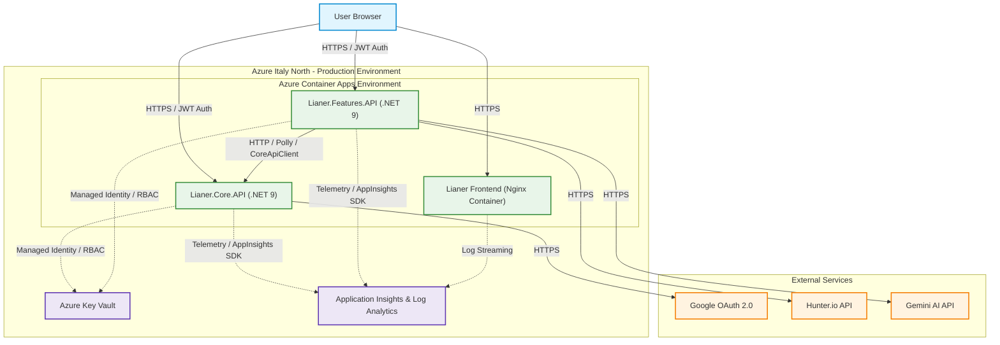
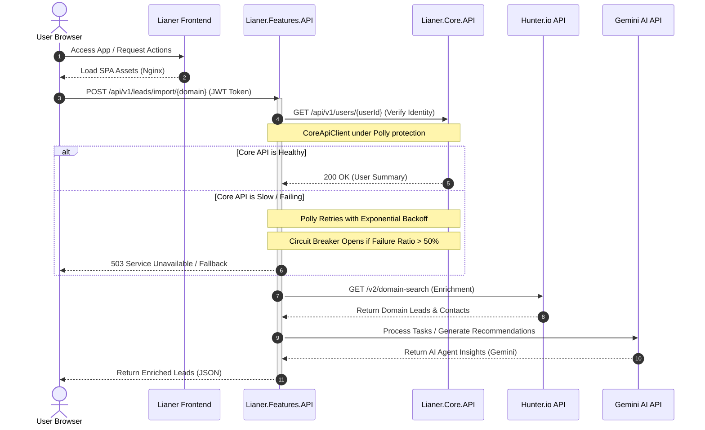

# Lianer Backend 2.0

<p align="left">
  <a href="README.md" title="English"></a>
  &nbsp;
  <a href="README.es.md" title="Español"></a>
  &nbsp;
  <a href="README.sv.md" title="Svenska"></a>
  &nbsp;
  <a href="README.de.md" title="Deutsch"></a>
  &nbsp;
  <a href="README.ko.md" title="한국어"></a>
  &nbsp;
  <a href="README.ja.md" title="日本語"></a>
  &nbsp;
  <a href="README.zh.md" title="中文"></a>
</p>

[英语](README.en.md) | [中文](README.zh.md) | [文档](deployment.md) | [ADR](docs/adr/0001-choosing-azure-hosting.md) | [AI](README.zh.md#ai-驱动功能-gemini-ai-集成) | [前端在线演示](https://lianer-frontend.icybush-5ce7e353.italynorth.azurecontainerapps.io)

一个面向云部署构建的安全分布式 ASP.NET Core 9 微服务架构。系统包含 JWT 身份验证、Google OAuth2 集成、与 Hunter.io 和 Gemini AI 的外部 API 通信、无密码 Azure Key Vault 集成、CI/CD、监控，以及容器化全栈部署。

**在线应用:** [Lianer Frontend App](https://lianer-frontend.icybush-5ce7e353.italynorth.azurecontainerapps.io)


---

## 目录

- [部署和系统状态](#部署和系统状态)
- [架构](#架构)
- [功能](#功能)
- [快速开始](#快速开始)
- [API 文档](#api-文档)
- [安全](#安全)
- [测试](#测试)
- [CI/CD 流水线](#cicd-流水线)
- [高级设计与弹性模式](#高级设计与弹性模式)
- [Team](#team)

---

## 部署和系统状态

系统已经完全容器化，并部署在统一的 Azure 云环境中。本节总结应用栈如何构建、加固、质量验证、监控并发布到生产环境。

<details>
<summary><b>容器化与 Azure 托管</b></summary>

为了保证可复现的生产环境，整个应用栈都已容器化。`Lianer.Core.API` 和 `Lianer.Features.API` 使用 multi-stage Dockerfile 和最小化的 .NET chiseled runtime image。服务以非特权用户 `app` 在 **8080** 端口运行，从而减少攻击面并支持 defense in depth。前端 SPA 被打包在非特权 Nginx 容器中。由于 Azure for Students 的区域限制，项目选择 Azure Container Apps 而不是 Azure Static Web Apps。

See [deployment.md](deployment.md) and [ADR 0001: Choosing Azure Hosting](docs/adr/0001-choosing-azure-hosting.md) for full details.

<details>
<summary><b>Screenshots</b></summary>


*Azure Container Apps running status.*


*ACA environment variables configuration.*
</details>
</details>

<details>
<summary><b>安全配置与 Key Vault</b></summary>

生产密钥已从源代码中移除，并存储在 Azure Key Vault 中。Azure Container Apps 通过 Managed Identity 和 Azure RBAC 的 `Key Vault Secrets User` 角色访问密钥。本地开发可通过 `DefaultAzureCredential()` 逻辑安全回退到 User Secrets。

<details>
<summary><b>Screenshots</b></summary>


*Key Vault RBAC role assignments.*


*Azure Key Vault secrets list.*
</details>
</details>

<details>
<summary><b>CI/CD</b></summary>

GitHub Actions 会验证每个 pull request，并在合并到 `main` 后自动部署。部署流水线使用 OIDC Federated Credentials，构建生产镜像，用 GitHub commit SHA 打标签，推送到 Azure Container Registry，并更新 Italy North 区域中的 Azure Container Apps。
</details>

<details>
<summary><b>可观测性与监控</b></summary>

Application Insights 和 Log Analytics 会收集 HTTP 请求、响应时间、状态码、异常、外部依赖调用、日志，以及整个服务链中的 Application Map trace。

<details>
<summary><b>Screenshots</b></summary>


*Distributed tracing map in Application Insights.*


*Live telemetry stream in Application Insights.*


*Average response time per endpoint query results.*


*Traffic trend query results.*


*Failed external requests dependency query.*
</details>
</details>

---

## 架构

### System Architecture Map

下图展示部署在 Azure 中的 Lianer 全栈应用的云基础设施和请求流。



### Request and Resilience Flow

下面的 sequence diagram 展示请求如何通过系统，由 Polly 弹性机制保护，并通过 Gemini AI 功能增强。



<details>
<summary><b>服务细节与服务间通信</b></summary>

系统分为 Vanilla JavaScript 前端、负责用户/会话/联系人/活动/笔记的 `Lianer.Core.API`，以及负责 leads、导入、task 处理和 AI 辅助功能的 `Lianer.Features.API`。

### Core API 端点

**User & Session Management**
- `POST /api/v1/users`
- `GET /api/v1/users`
- `GET /api/v1/users/{id}`
- `PUT /api/v1/users/{id}`
- `DELETE /api/v1/users/{id}`
- `POST /api/v1/sessions`
- `POST /api/v1/sessions/google`
- `GET /api/v1/sessions/google/url`

**Contacts Management**
- `GET /api/v1/contacts/{id}`
- `POST /api/v1/contacts`
- `PUT /api/v1/contacts/{id}`
- `DELETE /api/v1/contacts/{id}`

**Activities Management**
- `GET /api/v1/activities`
- `GET /api/v1/activities/{id}`
- `GET /api/v1/activities/user/{id}`
- `POST /api/v1/activities`
- `PUT /api/v1/activities`
- `DELETE /api/v1/activities/{id}`

**Activity Notes Management**
- `GET /api/v1/activities/{activityId}/notes`
- `GET /api/v1/activities/{activityId}/notes/{noteId}`
- `POST /api/v1/activities/{activityId}/notes`
- `PUT /api/v1/activities/{activityId}/notes/{noteId}`
- `DELETE /api/v1/activities/{activityId}/notes/{noteId}`

### Features API 端点

- `GET /api/v1/leads`
- `GET /api/v1/leads/{id}/details`
- `GET /api/v1/leads/enrich/{domain}`
- `POST /api/v1/leads/import/{domain}`
- `PATCH /api/v1/leads/{leadId}/assign`
- `POST /api/v1/leads/prepare-test`

### Inter-service Communication

`Lianer.Features.API` 通过 `CoreApiClient` 与 `Lianer.Core.API` 通信，并由 Polly retry 和 circuit-breaker policy 保护。

<details>
<summary><b>Screenshot</b></summary>


*Terminal output showing successful communication between Core API and Features API.*
</details>
</details>

---

## 功能

<details>
<summary><b>Technical Feature List</b></summary>

### RESTful API 设计

- 使用复数资源 URL，例如 `/api/v1/users` 和 `/api/v1/leads`
- 正确使用 GET、POST、PUT、PATCH、DELETE
- 标准化状态码
- 使用 DTO 分离数据库模型和 API contract
- 通过 `Asp.Versioning.Http` 进行 URL versioning

### 安全

- 基于 HMAC-SHA256 的 JWT Bearer Authentication
- BCrypt password hashing
- 支持自动注册的 Google OAuth2 SSO
- 不使用 `AllowAnyOrigin()` 的严格 CORS
- Data Annotations 和集中 validation
- 受保护操作的 ownership check

### 性能与缓存

- 用于高成本 GET endpoint 的 MemoryCache
- 写操作时进行 cache invalidation
- 带 jitter 的 exponential backoff
- fixed-window rate limiting
- pagination 和 filtering

### 外部集成

- Hunter.io 用于 domain search 和 lead enrichment
- Google OAuth2 用于 SSO
- Google Gemini 用于 categorization、insights 和 recommendations
- Azure Key Vault 和 User Secrets
- Polly resilience policies

<details>
<summary><b>Screenshot</b></summary>


*Scalar API documentation for bulk lead import.*
</details>
</details>

---

## 快速开始

<details>
<summary><b>Setup, Installation & Running Guide</b></summary>

### 先决条件

- .NET 9.0 SDK 或更高版本
- Git
- Visual Studio、VS Code 或 Rider
- Google OAuth2 credentials
- Hunter.io API key

### 1. 克隆仓库

```bash
git clone https://github.com/exikoz/Lianer-backend.git
cd Lianer-backend
```

### 2. 配置 User Secrets

**Core API:**

```bash
cd Lianer.Core.API

dotnet user-secrets set "JwtSettings:SecretKey" "MySecretKeyMustBeAtLeastThirtyTwoChars123!!"
dotnet user-secrets set "JwtSettings:Issuer" "LianerIssuer"
dotnet user-secrets set "JwtSettings:Audience" "LianerAudience"
dotnet user-secrets set "JwtSettings:ExpirationMinutes" "60"

dotnet user-secrets set "Google:Auth:ClientId" "YOUR_CLIENT_ID.apps.googleusercontent.com"
dotnet user-secrets set "Google:Auth:ClientSecret" "YOUR_CLIENT_SECRET"
dotnet user-secrets set "Google:Auth:RedirectUri" "http://localhost:3000/auth/callback"

dotnet user-secrets list
```

**Features API:**

```bash
cd ../Lianer.Features.API

dotnet user-secrets set "Hunter:ApiKey" "YOUR_HUNTER_API_KEY"

dotnet user-secrets list
```

### 3. 构建项目

```bash
cd ..
dotnet build
```

### 4. 运行服务

```bash
# Terminal 1: Core API
cd Lianer.Core.API
dotnet run --launch-profile https
# Listening on: https://localhost:5297

# Terminal 2: Features API
cd Lianer.Features.API
dotnet run --launch-profile https
# Listening on: https://localhost:5298
```

### 端口

| Service | HTTP | HTTPS |
|---------|------|-------|
| Core API | 5297 | 7115 |
| Features API | 5266 | 7089 |
</details>

---

## API 文档

<details>
<summary><b>Scalar API Details & Verification</b></summary>

两个服务都在 development mode 下通过 Scalar 暴露交互式 API 文档。Core API 可用于测试 registration、login、Google SSO、JWT 保护端点、contacts、activities 和 notes。Features API 可用于测试 lead enrichment、bulk import，以及包含 Core API 用户名的 enriched leads。

### Core API

**URL:** `https://localhost:5297/scalar/v1`


*Google OAuth2 endpoint testing in Scalar.*


*Successful registration of a new user in Core API.*

### Features API

**URL:** `https://localhost:5298/scalar/v1`


*Enriched lead list with usernames from Core API.*


*Successful import and enrichment of leads from Hunter.io in Features API.*
</details>

---

## 安全

<details>
<summary><b>Authentication, SSO, CORS & Key Vault</b></summary>

### JWT Bearer Authentication

用户注册并登录后会收到一个 60 分钟有效的 JWT，客户端在调用受保护端点时以 `Authorization: Bearer {token}` 发送该 token。

```json
{
  "sub": "user-guid",
  "name": "John Doe",
  "email": "john@example.com",
  "userId": "user-guid",
  "exp": 1714838400
}
```

### Google OAuth2 SSO

Google OAuth2 会获取 authorization URL，将用户重定向到 Google，在 Core API 中验证返回的 token，自动注册首次登录的 Google 用户，并返回本地 JWT。

### CORS Policy

应用使用显式 CORS allow-list，不使用 `AllowAnyOrigin()`。

```csharp
builder.Services.AddCors(options =>
{
    options.AddPolicy("DefaultPolicy", policy =>
    {
        policy.WithOrigins(
                builder.Configuration.GetSection("Cors:AllowedOrigins").Get<string[]>()
                ?? ["http://localhost:5173", "http://localhost:3000"])
            .AllowAnyHeader()
            .AllowAnyMethod()
            .AllowCredentials();
    });
});
```

### Rate Limiting

```csharp
builder.Services.AddRateLimiter(options =>
{
    options.AddFixedWindowLimiter("fixed", limiterOptions =>
    {
        limiterOptions.PermitLimit = 100;
        limiterOptions.Window = TimeSpan.FromMinutes(1);
        limiterOptions.QueueLimit = 10;
    });
});

app.MapControllers().RequireRateLimiting("fixed");
```

### Azure Key Vault

生产密钥通过 Managed Identity 和 Azure RBAC 从 Azure Key Vault 读取。本地开发使用 User Secrets 作为安全 fallback。


*Azure Key Vault secrets overview.*
</details>

---

## 测试

<details>
<summary><b>Testing Suite</b></summary>

后端使用 unit tests、integration tests 和 Dependency Injection validation 来尽早发现配置错误。

### Running Tests

```bash
# All tests
dotnet test

# Only unit tests
dotnet test --filter Category=Unit

# Only integration tests
dotnet test --filter Category=Integration

# With code coverage
dotnet test /p:CollectCoverage=true
```

### Dependency Injection Validation

```csharp
builder.Host.UseDefaultServiceProvider(options =>
{
    options.ValidateScopes = true;      // Prevents Captive Dependencies
    options.ValidateOnBuild = true;     // Prevents missing registrations
});
```
</details>

---

## CI/CD 流水线

<details>
<summary><b>CI/CD Pipeline Architecture & Deployment</b></summary>

Pull request 会通过 frontend tests、backend tests 和 dry-run Docker builds 验证。合并到 `main` 会触发 image build、ACR push、commit-SHA tagging 和 Azure Container Apps revision update。
</details>

---

## 高级设计与弹性模式

<details>
<summary><b>Advanced Backend Features</b></summary>

后端包含 custom exception middleware、ProblemDetails 风格响应、Polly retries、circuit breakers、MemoryCache、cache invalidation、typed HTTP clients 和 external API integrations。
</details>

---

## 外科式测试流程 (End-to-End)

<details>
<summary><b>Verification Phases</b></summary>

End-to-end 验证流程包括创建用户、登录、授权 Scalar、导入 leads、列出 leads、分配 lead，并验证 details 中出现 `assignedToName`。

1. `POST /api/v1/users`
2. `POST /api/v1/sessions`
3. Authorize Scalar with BearerAuth.
4. `POST /api/v1/leads/import/microsoft.com`
5. `GET /api/v1/leads`
6. `PATCH /api/v1/leads/{leadId}/assign`
7. `GET /api/v1/leads/{leadId}/details`
</details>

---

## 可观测性与监控

<details>
<summary><b>Observability & Monitoring Details</b></summary>

生产环境会将 telemetry、latency、exceptions、logs 和 dependency calls 发送到 Application Insights 与 Log Analytics。`deployment.md` 包含 runbook 步骤和 KQL 示例。
</details>

---

## AI 驱动功能 (Gemini AI 集成)

<details>
<summary><b>AI Feature Details</b></summary>

Features API 通过 server-side AI agent 集成 Gemini AI，帮助分类 tasks/leads、生成 insights 和 recommendations。Gemini key 存储在 Azure Key Vault 中，并在 startup 时注入。
</details>

---

## Team

**API Architects - .NET Team Malmö**

- [Joco Borghol](https://github.com/JocoBorghol) - Fullstack Developer
- [Alexander Jansson](https://github.com/alexanderjson) - Fullstack Developer
- [Hussein Hasnawy](https://github.com/exikoz) - Fullstack Developer

---

## Contact

如有问题或反馈，请通过 GitHub Issues 联系团队，或创建 Pull Request。

**Repository:** [https://github.com/exikoz/Lianer-backend](https://github.com/exikoz/Lianer-backend)

---

## 技术验证 (日志)

<details>
<summary><b>System Logs & Verification</b></summary>

### Caching & Invalidation

```text
info: GET /api/v1/leads called (Cache Check)
info: Cache miss. Fetching fresh data and enriching.
info: Saved 10 entities to in-memory store.
...
info: GET /api/v1/leads called (Cache Check)
info: Returning leads from cache.
```

### Resilience with Polly

```text
info: Polly[3]
      Execution attempt. Source: 'CoreApiClient-core-api-pipeline//Retry', 
      Operation Key: '', Result: '200', Attempt: '0', Execution Time: 19.3348ms
```

### Security & Error Handling

```text
warn: Login failed: Invalid password for email test@test.se
fail: Unhandled exception caught by middleware. Status: 401, Path: /api/v1/sessions
...
info: User authenticated successfully: 17c98dcb-9e66-4d3b-9eea-2508d7270839
info: JWT token generated for user: 17c98dcb-9e66-4d3b-9eea-2508d7270839
```
</details>
