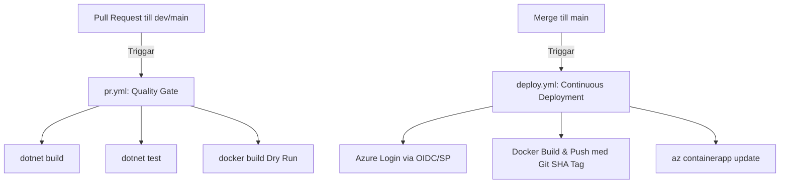

# Systemdesign och Arkitekturbeslut

**Utvecklare:** Joco Borghol

Detta dokument utgör den individuella dokumentationen för systemets övergripande design, arkitekturbeslut och säkerhetsstrategier i molnet för **Lianer fullstack**.

---

## 1. Projekt-setup & baslinje för drift (Epic 1)

### Arkitektur & Beslut
Vi har genomfört en fullständig arkitekturinventering av alla systemkomponenter:
- **Lianer.Core.API** (.NET 9): Ansvarar för användarhantering, sessioner, JWT-generering och Google SSO.
- **Lianer.Features.API** (.NET 9): Ansvarar för lead-berikning via externa API:er (Hunter.io) och Polly-resiliens.
- **Lianer Frontend**: En statisk Vanilla JS-webbapplikation.

### Miljödefinitioner (Lokal vs. Produktion)
1. **Lokal miljö:**
   - Körs lokalt med HTTPS.
   - Hemligheter hanteras via lokala **User Secrets** (`dotnet user-secrets`) och sparas aldrig i källkoden.
2. **Produktionsmiljö:**
   - Driftsatt i Azure Container Apps i en enhetlig resursgrupp i regionen **Italy North**.
   - Hemligheter lagras centralt i **Azure Key Vault** och hämtas dynamiskt via **Managed Identity**.

### Dokumentation & Uppstart
Instruktioner för hur systemet sätts upp och startas lokalt har dokumenterats i [README.sv.md](file:///c:/Users/D/Lianer-backend/README.sv.md).

---

## 2. Hostingval (Hosting Choices) (Epic 2)

### Arkitektur & Beslut
Vi har valt en fullständigt containeriserad arkitektur i **Azure Container Apps (ACA)** för både backend och frontend.

- **Backend-mikrotjänster:** `Lianer.Core.API` och `Lianer.Features.API` körs som oberoende Container Apps i en delad Container Apps Environment.
- **Frontend-applikation:** Frontenden (Vanilla JS SPA) är paketerad i en minimal, rootless Nginx-avbild (`nginxinc/nginx-unprivileged:alpine`) och körs på port 8080 som en egen Container App i samma miljö.

### Motivering & Jämförelse
1. **Azure App Service vs. Azure Container Apps (Backend):**
   - Att köra flera mikrotjänster i App Service skulle kräva antingen en separat App Service-plan för varje tjänst (kostsamt) eller en komplicerad multi-container-konfiguration som är svår att skala oberoende.
   - ACA tillhandahåller en delad miljö (Container Apps Environment) där vi betalar för faktiskt resursutnyttjande. Det stöder automatisk skalning baserad på HTTP-trafik, inklusive **skalning till noll** under inaktiva perioder, vilket minimerar kostnaderna till 0 kr när applikationen inte används.
2. **Azure Static Web Apps (SWA) vs. Container på ACA (Frontend):**
   - Ursprungligen planerades Azure Static Web Apps (SWA) för frontenden (se [ADR 0001](file:///c:/Users/D/Lianer-backend/docs/adr/0001-choosing-azure-hosting.md)).
   - På grund av begränsningar i *Azure for Students*-prenumerationen är Static Web Apps blockerat av resurs- och regionpolicyer i vår tilldelade resursgrupp (Policy Error: `RequestDisallowedByAzure`).
   - Lösningen blev att containerisera frontenden och köra den i ACA. Detta gav en mer enhetlig arkitektur där hela fullstack-miljön ligger i samma resursgrupp och nätverksmiljö i regionen **Italy North**.

---

## 3. Pipeline-design (CI/CD Pipeline) (Epic 3)

Vår pipeline-design i GitHub Actions är uppdelad i två faser för att säkerställa hög kvalitet och fullständig spårbarhet.



### Quality Gates (`pr.yml`)
- Triggas vid alla Pull Requests mot `main` eller `dev`.
- Bygger backend-projekten (`dotnet build`) och kör alla enhetstester och integrationstester (`dotnet test`).
- Genomför en **docker build dry-run** på samtliga Dockerfiles (Frontend Nginx, Core API och Features API) i GitHub Actions runner-miljön. Detta förhindrar att trasig container-infrastruktur mergas till utvecklingsgrenarna.

### Continuous Deployment (`deploy.yml`)
- Triggas vid merge/push till `main`.
- **Lösenordsfri inloggning:** Använder GitHub OIDC Federated Credentials mot en Azure Service Principal (SP) för säker inloggning utan statiska lösenord i GitHub Secrets.
- **SHA-taggning för spårbarhet:** Varje Docker-image taggas med det specifika **GitHub Commit SHA** (t.ex. `lianer-core-api:a816a84...`) istället för enbart `latest`. Detta uppfyller VG-kravet på full spårbarhet: om ett fel uppstår i produktion kan vi direkt härleda den körande container-avbilden till den exakta källkodsraden i Git.
- **Rolling Updates:** Pipeline uppdaterar respektive Container App med den nya SHA-avbildningen genom `az containerapp update`.

---

## 4. Säkerhetsstrategi & Defense in Depth (Säkerhet)

Vi tillämpar ett proaktivt säkerhetsdjup (Defense in Depth) genom flera oberoende skyddslager:

1. **CORS-konfiguration i produktion:**
   - Vi tillåter **inte** `AllowAnyOrigin` (`*`) i produktion.
   - CORS-policies på `Lianer.Core.API` och `Lianer.Features.API` konfigureras via Azure CLI och systeminställningar att endast acceptera anrop från den specifika frontend-domänen (`*.azurecontainerapps.io`).
2. **Containersäkerhet (Chiseled & Rootless):**
   - Backend-containrarna körs på `.NET Noble Chiseled` (`mcr.microsoft.com/dotnet/aspnet:9.0-noble-chiseled`). Dessa avbilder saknar helt operativsystemsskal (`bash`/`sh`), pakethanterare och systemverktyg. Detta eliminerar möjligheten för en angripare att ladda ner skadlig kod eller köra shell-kommandon om applikationen komprometteras.
   - Apparna körs under en icke-privilegierad användare (`USER app` / UID 1654). Containrarna lyssnar på port **8080** eftersom icke-root-användare inte har rättigheter att binda till privilegierade portar (< 1024, t.ex. port 80). Detta förhindrar privilegieeskalering (privilege escalation) mot värdsystemet.
   - Frontenden körs i en `nginx-unprivileged` container som följer samma princip av rootless exekvering.
3. **Dependency Injection (DI) Validering:**
   - I `Program.cs` har vi aktiverat `ValidateScopes` och `ValidateOnBuild`. Detta validerar tjänsternas livscykler vid uppstart och förhindrar "Captive Dependencies" (t.ex. att en Scoped-tjänst injiceras i en Singleton-tjänst och håller kvar resurser felaktigt), vilket stärker driftsäkerheten.

---

## 5. Key Vault & Identity (Lösenordsfri hemlighetshantering) (Epic 4)

Vi har eliminerat statiska autentiseringsuppgifter och hårdkodade lösenord i produktion.

```
+-----------------------------------+
|     Azure Container App (ACA)     |
|  [System-Assigned Managed Identity]
+-----------------+-----------------+
                  |
                  | (Lösenordsfri RBAC-handskakning)
                  v
+-----------------+-----------------+
|        Azure Key Vault            |
|  [Rollen: Key Vault Secrets User] |
+-----------------------------------+
```

- **Managed Identity:** Både `ca-lianer-core` och `ca-lianer-features` är konfigurerade med **System-assigned Managed Identity**. Identiteten är direkt kopplad till resursens livscykel i Azure.
- **Rollbaserad behörighet (RBAC):** Istället för de äldre Access Policies använder vi Azure RBAC via Bicep-kod (`infra/roleAssignments.bicep`). Resurserna tilldelas rollen **Key Vault Secrets User** (ID `4633458b-17de-408a-b874-0445c86b69e6`), vilket ger dem minsta möjliga behörighet: att läsa hemligheter under körning (ingen skriv- eller borttagningsrättighet).
- **Lokal Fallback (Zero-Secret Dev):** I `Program.cs` använder vi `DefaultAzureCredential()`. Vid lokal körning faller autentiseringen tillbaka på utvecklarens lokala inloggning eller lokala **User Secrets** (`dotnet user-secrets`), vilket innebär att inga utvecklare behöver dela på känsliga produktionsnycklar.

---

## 6. Övervakning & Observability (Felsökbarhet) (Epic 5)

Vi har satt upp en robust övervakningsinfrastruktur med **Application Insights** och **Log Analytics Workspace**.

### Distribuerad Spårning (Application Map)
Application Insights SDK (`Microsoft.ApplicationInsights.AspNetCore`) är installerat i båda mikrotjänsterna. Det korrelerar anrop automatiskt genom inkommande och utgående headers (W3C Trace Context).
Detsta visualiserar hela anropskedjan:
`Browser ➔ Frontend ➔ Features API ➔ Core API ➔ Externa API:er (Hunter.io)`

### Operations Runbook & KQL
Felsökning sker i första hand i Azure Portal eller via Azure CLI:
1. **Realtidsloggar:** `az containerapp logs show --name lianer-core-api --resource-group rg-lianer-prod --follow`
2. **KQL-analys (Kusto Query Language):**
   * *Prestandaanalys (Medelsvarstid per endpoint):*
     ```kql
     requests
     | summarize GenomsnittligSvarstidMs = avg(duration), AntalAnrop = count() by name
     | order by GenomsnittligSvarstidMs desc
     ```
   * *Beroendeanalys (Externa anrop till t.ex. Hunter.io):*
     ```kql
     dependencies
     | summarize MedeltidMs = avg(duration), Misslyckade = countif(success == false) by target
     ```

---

## 7. Fullstack-integration (Epic 6)

Fullstack-integrationen driftsätter och sammankopplar frontenden och backenden sömlöst.

### Genomförda förändringar & Buggfixar
Vi har genomfört följande kritiska anpassningar för att garantera full kompatibilitet med frontenden:
1. **Endpoint för kontakthämtning:** Skapade en `[HttpGet]` endpoint i `ContactsController` för att tillåta frontenden att hämta listor av kontakter med paginering (`GetContacts`).
2. **Null-hantering i Sociala Medier:** Löste krascher i mappningen av kontakter genom att lägga till null-säkring i `ContactSocialDto` (`Social = contact.Social is null ? null : ...`). Detta tillåter import av kontakter som saknar LinkedIn/webbsida utan att api:et kastar undantag.
3. **Säker Token-baserad Användaridentifiering:** Ändrade `ActivityController` och `NoteController` så att de läser användar-ID direkt från JWT-tokens `ClaimTypes.NameIdentifier` via `CurrentUserId` istället för att lita på inkommande fält i förfrågans body. Detta täpper till en allvarlig säkerhetslucka där en inloggad användare annars kunde skapa aktiviteter i andras namn.
4. **Resistent Resurs-uppdatering:** Korrigerade `Activity.Update` i domänmodellen för att tillåta uppdatering och av-tilldelning av ansvariga användare utan restriktioner.

---

## 8. AI-Integration (Epic 7)

### Planerad Design och Koncept
1. **Syfte:** Att erbjuda en serverside-driven AI-analys av leads och aktiviteter i `Lianer.Features.API` via Google Gemini AI API.
2. **Säkerhet:** Gemini API-nyckeln kommer att sparas centralt i Azure Key Vault under namnet `Gemini--ApiKey` och hämtas löpande utan exponering i kod.
3. **Robusthet & UX:** 
   - Anropen omsluts av en try-catch-blockering för att hantera transienta nätverksfel och rate limits.
   - Vid eventuella fel (t.ex. om Gemini AI är otillgängligt eller returnerar ogiltigt svar) faller systemet graciöst tillbaka på en lokal textbaserad sammanfattning/kategorisering. Användaren meddelas utan att applikationens huvudflöde kraschar.
